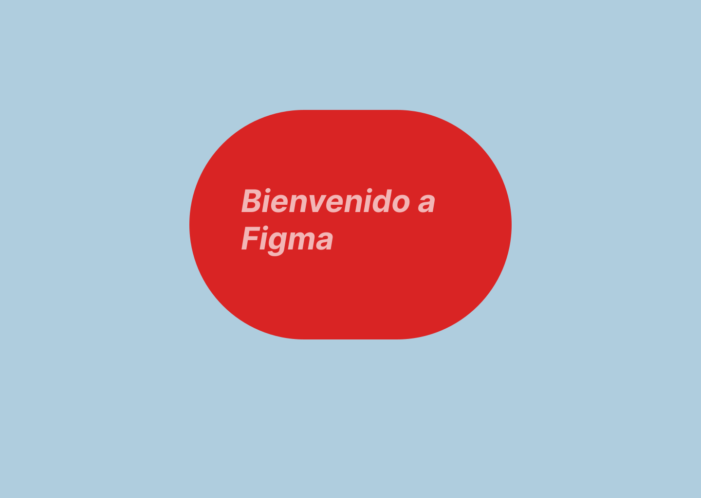
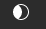
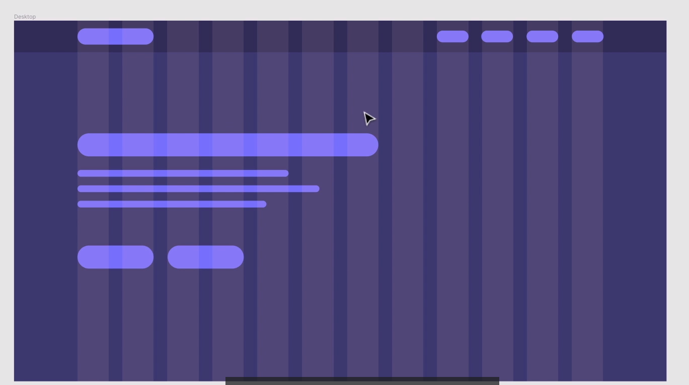
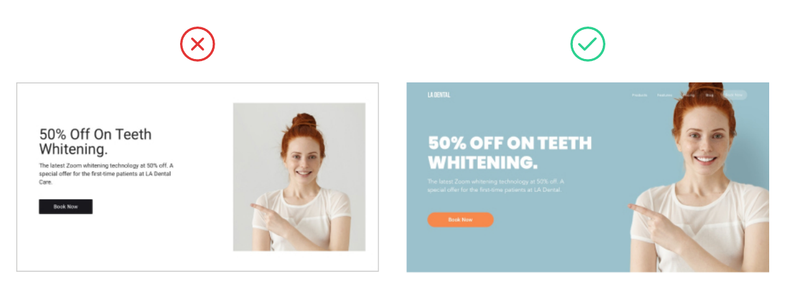
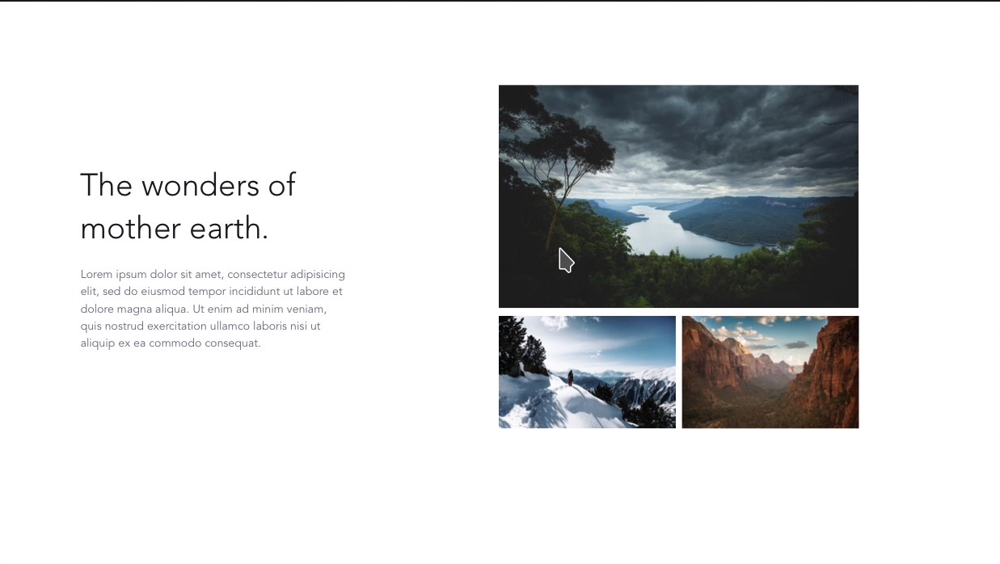
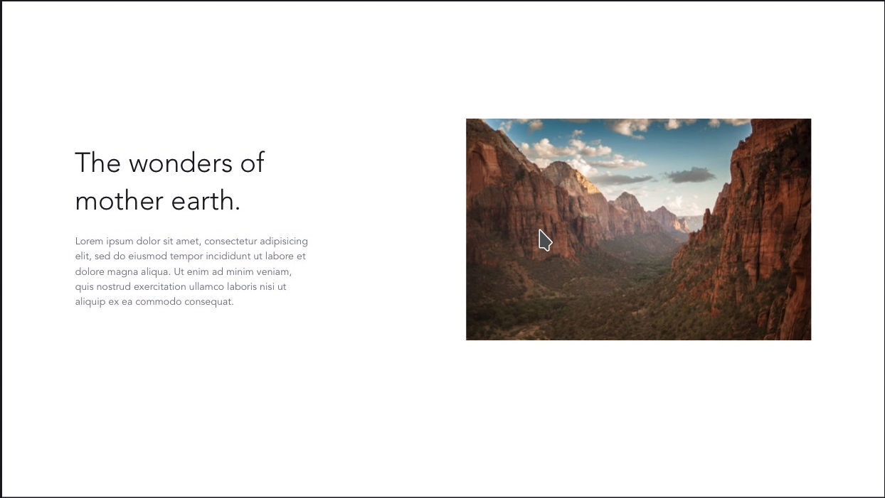

# Actividades

Consulta la [guía de la unidad](guiaUnidad.md) para seguir el orden de aprendizaje. La numeración se conserva; la actividad 21 reúne el proyecto que continuará en las siguientes unidades.

## Actividad 1

**Recorrido:** B03 · Análisis visual. **Evidencia:** Cuaderno de análisis.

En este ejercicio tenéis que asociar los principios que hemos visto con las siguientes acciones:

- Contraste de elementos. (color, tipografias)
- Similitud (agrupaciones).
- Composición.

Basate en los los principios de Gestalt y que acción es la que se quiere conseguir.

Analiza las siguientes

- [David Simon](http://davidsimon.com/)
- [electric plup](http://electricpulp.com/)

## Actividad 2

**Recorrido:** B05 · Sistema visual. **Evidencia:** Ficha de componente.

Analiza la guía de estilos de Material Design. Contesta a las siguientes preguntas:

1. Escoge un componente concreto e identifica qué funciones cumplen sus colores (texto, fondo, acción y estados). Registra la página y fecha consultadas.
2. ¿Qué fuentes esta utilizando?.
3. Lee las sección shape( forma). ¿Qué funciones realiza la forma en un interfaz?.

## Actividad 3

**Recorrido:** B01 · Tareas y dificultades. **Evidencia:** Cuaderno de análisis.

Analiza el siguiente juego. [User inyerface](https://userinyerface.com/) que reproduce los peores errores de diseño de interfaces de usuario. Contesta a las siguientes preguntas:

- ¿Cómo de fácil es moverse por el sitio?
- Describe hasta cinco problemas observados, la tarea que dificultan y una posible mejora. No inventes problemas para alcanzar una cantidad.

## Actividad 4

**Recorrido:** B01 · Herramientas. **Evidencia:** Registro de pruebas.

Instala y prueba las siguientes extensiones de navegadores:

- ColorZilla.
- Fire Shot o Full Page Screen Capture.
- Responsive Web Designe Tester.
- Page Ruler.
- Highlight H1,H2,H3 & highlight nofolow.

## Actividad 5

**Recorrido:** B02 · Estructura. **Evidencia:** Análisis de identificación/navegación/contenido.

Detecta en las siguientes webs los elementos de identificación, navegación y contenidos

- blog.gluubo.com
- google.com
- ua.es

## Actividad 6

**Recorrido:** B02 · Comparación histórica. **Evidencia:** Dos versiones comentadas.

En archive.org se puede ver la evolución de casi cualquier web a lo largo de los años. Observa la evolución de las webs propuestas anteriormente.

- elpais.com
- google.com
- ua.es

## Actividad 7

**Recorrido:** B02 · Mapa. **Evidencia:** Recuento con alcance y valoración.

Visualiza el siguiente mapa del sitio [gva-mapa](https://www.gva.es/va/inicio/mapa_web). ¿Cuantas páginas tiene? ¿cuantas categorías hay?. ¿Te parece útil el mapa del sitio?.

## Actividad 8

**Recorrido:** B01 · Usuarios. **Evidencia:** Perfiles, boceto y verificación.

En una universidad quieren realizar una web para que los alumnos , profesores y profesionales puedan encontrar, publicar , leer, comentar artículos fácilmente. Vamos a diseñar nuestra web en base a nuestros usuarios. Lo primero, necesitamos conseguir conocer a nuestros **usuarios objetivo** , para lo cual necesitamos saber de ellos la siguiente información:

- Contexto de uso, experiencia relevante y tarea principal. Utiliza perfiles ficticios y evita datos personales innecesarios.
- Requisitos (sobre la web).
  – Necesidades(sobre la web).

### Ejemplos.Información sobre personas:

**Persona 1 · Ejemplo ficticio**

- **Nombre, trabajo e información personal**
  - Nombre y apellidos: Walter Mattaus.
  - Departamento de administración y tecnologías.
  - Poco tiempo para leer.
- **Requisitos**

  - Lee sobre las últimas tendencias.
  - Comparte sus conocimientos.
  - Encuentra revisión de trabajo.

- **Neccesidades**
  - Puedo escribir artículos.
  - Puedo leerlo en mi tablet.
  - Puedo guardar artículos.

**Persona 2 · Ejemplo ficticio**

- **Nombre, trabajo e información personal**
  - Nombre y apellidos: Elisa warner.
  - Pasante
- **Requisitos**

  - Sigue a sus compañeros.
  - Consigue pagos por revisiones.
  - Lee artículos sobre química.

- **Neccesidades**

  - Puedo leer artículos desde el teléfono.
  - Puedo escribir artículos desde el teléfono.
  - Puedo recibir alertas de las novedades.

Ahora el trabajo que tenéis que hacer es construir y verificar lo siguiente:

- Identificar la **características principales** de las personas que he creado. Es solo una, que es común a las dos personas.
- Entender porqué las personas necesitan estas.
- Buscar como **otras personas** han solucionado este problema. Es decir, investiga webs que solucionen el problema.
- Crear un boceto vuestro dando solución a esos problemas. (coger y dibujar una estructura de una web con las soluciones. Todavía no hemos visto la herramientas para tal cosa pero las veremos)
- Testar nuestro diseño con las personas objetivo.

## Actividad 9

**Recorrido:** B04 · Figma. **Evidencia:** Enlace, SVG y ficha.

Crea tu primer archivo de prácticas en Figma, en el espacio indicado en clase.

1. Crea una página y nombra frames y capas. Construye un título, un párrafo, una figura y una acción.
2. Usa como referencia la imagen del ejercicio original o los primeros frames de Mirada:

   

3. Comparte un enlace de consulta y comprueba los permisos con un compañero. No es necesario crear un equipo nuevo si el centro ya proporciona un espacio.
4. Exporta el frame a SVG y vuelve a abrirlo para comprobarlo.
5. Documenta ancho, espaciado, tipografía y color. Si tu cuenta permite consultar código CSS asociado, compáralo con esas propiedades; su disponibilidad no condiciona esta práctica inicial.

**Entrega:** enlace, SVG y una breve ficha de propiedades. El CSS que pueda mostrar la herramienta es una referencia; el HTML y CSS propios se construirán en UD2.

## Actividad 10

**Recorrido:** B05 · Tipografía. **Evidencia:** Ensayo con justificación.

En esta actividad, si acedemos al siguiente [link](https://www.figma.com/file/4bjwFph5AbBbITD1oZxX2B/Asigna-fuentes) nos mostrará un fichero pero no lo podemos editar. **Para editarlo** tenéis que hacer una copia del link que se crea en el sistema de ficheros (con el botón derecho).
En él hay dos columnas, la primera nos muestra la web que vamos a hacer y la segunda el porqué de este tipo de tipografía.

**_Recuerda que cada fuente, el autor, tiene una disposición que generalmente viene declarada en su documentación. En google fonts en la sección about._**

## Actividad 11

**Recorrido:** B05 · Tipografía. **Evidencia:** Ensayo con justificación.

Para este ejercicio utilizaremos una o dos familias tipográficas para practicar coherencia; no es una regla universal. En el siguiente ejercicio tenemos un título y un párrafo con una temática cada una.
Una gran inspiración de selección de fuentes puede ser carteles o otras webs que traten de los mismos temas.

[Asigna-Fuentes](<https://www.figma.com/file/Gvkmj8au5bXwV2yUXsIRBp/Actividad-11-(Asignaci%C3%B3n-de-fuentes)?node-id=8%3A11>)

## Actividad 12

**Recorrido:** B06 · Imagen y paleta. **Evidencia:** Original, máscara y paleta.

Esta actividad tiene varios propósitos; crear nuestra paleta de colores con respecto a una fotografía y saber como se introduce una imagen en figma. Además, de como se utiliza las mascaras para mostrar una parte de la foto.

Haz click [aquí](https://www.figma.com/file/T9Tb9vKCVL4KDT6n28tkDG/Actividad12Color?node-id=0%3A1) para acceder al fichero del ejercicio.

El primer ejercicio será insertar una imagen que cubra el 50% en el 2 frame. Como en el otro. Para ello vamos a realizar los siguientes pasos:

1. Descargar una imagen en el siguiente [link](https://unsplash.com/es). Comprueba las condiciones de uso del recurso elegido y registra autor, origen y licencia; no presupongas que cualquier imagen encontrada puede reutilizarse sin condiciones.
2. Inserta un **cuadrado** que ocupe la mitad del segundo frame.
3. Inserta un objeto, **una imagen**, en el frame. Lo más seguro es que sea más grande que frame. Date cuenta que se inserta como layer(capa). Esta es la forma de trabajar que tienen la mayoría de los programas de dibujo. Desde el menú, en la parte de la izquierda, de las capas las podemos poner en orden diferente arrastrándola. Comprueba lo que pasa. Nuestro objetivo es redimensionar la imagen de tal forma que ocupe la parte del cuadrado por encima del cuadrado. Si lo que queremos es mantener las proporciones, deberemos mantener el **shift** apretado.
4. Otra forma de insertar la imagen, pero esta vez como background del cuadrado antes de insertar la imagen deberemos seleccionar el cuadrado y después insertar la imagen. Pruébala , deshazlo y dejalo como en el paso anterior.
5. Ahora vamos a utilizar el concepto de máscara para mostrar una porción de la imagen. De la siguiente manera:

   1. Elija el rectángulo que desee usar como máscara y colóquelo detrás de la imagen en el menú de capas
   2. Seleccione todas las capas que formarán parte del objeto de máscara.
   3. Haga clic en  en la barra de herramientas

Una vez que tengamos el primer ejercicio vamos a recoger los colores más importantes de la foto. Para lo cual:

1. Seleccionar el mask group del panel de layers, una vez que lo hayamos seleccionado nos saldrá en la parte inferior derecha un conjunto de efectos.
2. Aplicaremos el efecto de layer blur de más o menos 24 para darnos una paleta de colores más adecuada.
3. A continuación utilizaremos el color picker para rellenar cuadrados, que tenéis que hacer, de los colores principales y secundarios de la foto. Color picker selecciona el color de un pixel y es por eso que hemos hecho el paso anterior. **Cuatro o cinco colores**
4. Ahora en la parte de la izquierda dibuja un cuadrado y ponlo en el fondo.
5. Cambia los colores de ese cuadrado y de los textos probando la mejor combinación.

Una vez que tengamos los colores podemos mejorarlos porque generalmente estos colores no son muy brillantes o disponen de una saturación ideal.
Mejora los colores y compara los diseños que hagas, copiando y pegando los frames.

## Actividad 13

**Recorrido:** B04 · Retícula. **Evidencia:** Frame con guías.

Ahora vamos a practicar la manera de colocar y alinear los elementos dentro de un frame.

1. Crea un deskop frame.
2. Selecciona Layout Grid. En 12 columnas.
3. Establece un margen de 140 por los lados.
4. Establece un gutter (margen entre las columnas) de 20px.
5. Activa o desactiva la visibilidad de la retícula desde las opciones de vista del editor; consulta el atajo de tu entorno.
6. Cambia el color de fondo del frame y el color del grid para que haga contraste.
7. Ahora vamos a crear nuestra barra de navegación que ocupa todo el frame. Esta va a ser un rectangulo de 70px . Cambiale el color y hazlo transparente (para que se vea las columnas)
8. Vamos a crear un logo con un rectangulo redondeado en sus esquinas, dentro de la barra de navegación, que ocupe dos columna en la parte de la izquierda del frame.
9. A partir del logo duplicamos , los atajos depende si lo estamos utilizando desde el navegador o si lo tenemos instalado. Para saber que atajo disponemos, nos vamos a la Ayuda. En mi caso es Ctrl+D, duplico el objeto seleccionado. Con esto podemos crear los elementos del menú que ocupen una columna en la parte derecha. Si Seleccionamos todos los objetos con Shift. Podemos alinearlos, utilizando las opciones de alineamiento de la parte superior derecha. **En este caso deberemos alinearlos verticalmente**.
10. Haz ahora un título, párrafo y un botón a partir del logo. Y disponlos como en la imagen.

## Actividad 14

**Recorrido:** B08 · Jerarquía. **Evidencia:** Composición comentada.

A partir del fichero del siguiente [link](https://www.figma.com/file/P7tAqMHgWlHgCVOikH37J5/Actividad14Jerarquia?node-id=55%3A26), crea una jeraquía visual. Es decir qué es lo queremos que el usuario vea primero, segundo, tercero y cuarto. Además, cambia tipografía, color. Utiliza el grid de doce columnas para ayudarte. Observa bien los objetos y colores para saber si combinan bien.

## Actividad 15

**Recorrido:** B06 · Velo sobre imagen. **Evidencia:** Comparativa de rellenos.

En este [link](https://www.figma.com/file/azENmIOmbmISGQ2Iu8lxPr/Actividad15Imagen-Overlays?node-id=2%3A1) encontrarás un fichero de figma donde hay dos frames. Utiliza las técnicas de overlay para hacer contraste entre el texto y la foto que os descarguéis para hacer de fondo. Para lo cual:

1. Descarga una foto que sea adecuada y llevarla al fondo.
2. Selecciona esta capa y añade un relleno (fill) de color negro y con transparencia (prueba rangos) que podamos ver el fondo claro.
3. Desatura la imagen a blanco y negro
4. Cambia el relleno que has introducido en el paso tres. Prueba degradados, colores etc.
5. Cambia colores de botones, texto etc.. Todo ello con el fin que haga contraste. **Recuerda todos los colores no valen.**

## Actividad 16

**Recorrido:** B06 · Recortes. **Evidencia:** Dos ensayos.

En `Mirada · Prácticas UD1`, crea los frames `A16-Crop` y `A16-SoftCrop`. Conserva la imagen original para comparar.

1. Recorta sin deformar y explica qué punto de interés mantienes.
2. Crea un recorte suave mediante un degradado y comprueba la lectura del texto.
3. Prueba un encuadre en tu proyecto y decide si lo mantienes o lo descartas.

**Entrega:** ambos ensayos y tres frases que expliquen la comparación. Sigue los pasos 25 y 28 de [Mirada](Ejemplo_Figma_Mirada.md).

El [archivo original de práctica](https://www.figma.com/file/BXN9drusYrLzy96lfkopcr/Actividad16recortes) queda como referencia adicional cuando esté disponible.

## Actividad 17

**Recorrido:** B09 · Comparación. **Evidencia:** Análisis razonado.

Analiza las dos imágenes de la misma web. En base a los siguientes parámetros:

- Contraste de elementos. (color, tipografías)
- Similitud (agrupaciones).
- Composición.
- Imagen
- Direccionalidad.

## Actividad 18

**Recorrido:** B09 · Superposición. **Evidencia:** Dos frames.

Crea un fichero en Figma dentro del grupo que tienes conmigo. Este fichero tiene que tener un frame por cada una de las imágenes que te muestro a continuación.

Una vez que tengas los dos frames. Modificalos mediante la técnica de superposición,para darle más importancia a las imágenes.

## Actividad 19

**Recorrido:** B09 · Tensión. **Evidencia:** Ensayo justificado.

En este [link](https://www.figma.com/file/K0NcOQQahOxlwMlmroAq0k/Actividad19Tension?node-id=1%3A2) encontrarás un fichero de figma donde encontrarás un frame con una imagen y el texto. Crea tensión en el diseño.

Consejos:

- Haz cropping sobre la imagen en un trapecio que divida la pantalla o también puede ser un ovoide etc.
- Mueve el texto
- Utiliza el contraste
- Utiliza la superposición.

## Actividad 20

**Recorrido:** B10 · Transferencia. **Evidencia:** Dos secciones y boceto estrecho.

### Ensayo autónomo de composición

Diseña una sección principal y una sección de funciones para una aplicación de chat. Utiliza lo aprendido con Mirada en un tema diferente. No es necesario desarrollar otra web completa.

1. Analiza una referencia de comunicación y registra origen y decisiones que inspira. Puedes consultar el [archivo de referencia original](https://www.figma.com/file/49ilcZ3LkX1l3lXz2PY239/Actividad20PrimeraWeb?node-id=107%3A2).
2. Escribe contenido propio: título, explicación, acción principal y tres funciones.
3. Crea una composición amplia y un boceto de reorganización estrecha.
4. Aplica una paleta, jerarquía y espaciados coherentes. Usa una instancia de botón.
5. Explica una decisión transferida de Mirada y otra que cambias por el nuevo contexto.

**Entrega:** dos frames y la explicación. La reproducción completa del antiguo ejemplo queda como ampliación voluntaria; el proyecto integrado de la unidad es A21.

## Actividad 21

**Recorrido:** B01–B12 · Proyecto propio. **Evidencia:** UD1-v1.

### Objetivo y continuidad

Elige un tema para un sitio web y prepara su diseño. Este mismo proyecto continúa en la actividad de proyecto de UD2; en UD2 aplicarás también CSS inicial y en UD3 profundizarás en el sistema visual y los estados. No es necesario adoptar un tema común para toda la clase.

### Pasos

1. **Brief:** describe el problema, dos perfiles y tres tareas. Distingue lo observado de las hipótesis. Usa la [plantilla de planificación](planificación.md).
2. **Contenido y navegación:** prepara un inventario y un mapa. Dibuja el recorrido de una tarea principal y dos alternativas de distribución para la página de inicio.
3. **Referencias:** crea un moodboard con ejemplos de composición, color y tipografía. Registra su origen y qué decisión te ayudan a explorar.
4. **Guía visual:** documenta colores por función, tipografía, espaciado, imágenes e iconos. Comprueba al menos tres pares de texto y fondo y registra el contraste.
5. **Componentes:** crea botón, tarjeta y campo con etiqueta; usa instancias en el prototipo. Representa estado normal y foco del botón, disponibilidad de la tarjeta y estado de error del campo. Si tu tema no necesita alguno, justifica un componente equivalente con estados comparables.
6. **Prototipo:** diseña la página principal en un ancho estrecho y otro amplio. Como casos de trabajo puedes usar 390 y 1280 px; explica cómo se reorganiza el contenido. Completa el recorrido de la tarea con bocetos enlazados de las pantallas necesarias. No se exige diseñarlas todas con el detalle de la principal.
7. **Revisión:** pide a un compañero que intente la tarea sin indicarle dónde pulsar. Registra resultado, dudas y una decisión mantenida o modificada con justificación. Si no se ha realizado, indica que la prueba está pendiente.

La representación de estados en el prototipo describe cómo debería funcionar la interfaz. Su funcionamiento real con teclado y sus mensajes se comprobarán durante la implementación.

### Entrega

- Brief, inventario, mapa y dos bocetos alternativos.
- Moodboard con fuentes y guía visual con comprobaciones de contraste.
- Archivo o enlace de Figma con permiso de consulta y exportación local de las dos versiones de la página principal.
- Componentes, estados y recorrido enlazado de una tarea.
- Registro de revisión, decisiones y aspectos pendientes.

Guarda los materiales en una carpeta identificada como `UD1-v1`. Si haces cambios, conserva una nueva versión y explica qué has modificado. No incluyas datos personales reales en los ejemplos.

### Lista de comprobación

| Aspecto | Evidencia esperada |
|---|---|
| Planificación | Usuarios, tareas y alcance relacionados |
| Alternativas | Dos bocetos y motivo de elección |
| Sistema visual | Valores por función, coherencia y contraste registrado |
| Reutilización | Componentes e instancias reconocibles |
| Adaptación | Principal estrecha/amplia con contenido legible |
| Revisión | Observaciones reales y decisión justificada, o prueba pendiente declarada |
| Continuidad | Archivos localizables y contenido preparado para HTML |

Esta lista explicita los requisitos de la actividad; no modifica los pesos ni las condiciones de evaluación del módulo. Una prueba pendiente no equivale a una prueba superada.

### Qué se reutiliza después

En UD2 llevarás el inventario y el mapa a HTML y navegación. Los primeros ejercicios de maquetación se apoyarán en el prototipo. En UD3 aplicarás la guía visual; en UD4 organizarás los estilos; en UD5 podrás comparar la implementación de componentes mediante un framework. Consulta el [mapa del módulo](../mapaModulo.md).
