# Ejemplo completo en Figma · Mirada

Vamos a diseñar la web de una asociación de fotografía. La persona que la visita quiere encontrar una salida, conocer sus requisitos y saber cómo participar. El ejemplo recorre los contenidos de UD1 y deja una referencia que podrás trasladar a tu proyecto de libre elección.

**Uso del ejemplo:** Mirada muestra paso a paso cómo desarrollar un diseño. No hay que entregar Mirada ni sus ejercicios, comprobaciones o exportaciones. Las indicaciones de compartir y exportar enseñan el procedimiento que después podrás aplicar a tu proyecto de la actividad 21.

**Duración orientativa:** 10–12 horas con revisión para recorrer el ejemplo completo.

[Ver todas las láminas](ejemplo-mirada/index.html){ .md-button }

Las imágenes de esta guía son **láminas de referencia del diseño**, creadas para el curso; no son capturas de la interfaz de Figma. Sigue los pasos desde un archivo vacío y utiliza el paisaje y los iconos cuando se indique. Compara tu resultado con las láminas y justifica tus decisiones.

Importar un SVG conserva objetos vectoriales, pero no crea por sí solo componentes, Auto Layout ni conexiones de prototipo. Estas operaciones forman parte de la práctica.

**Entorno del curso:** Figma Design en el navegador. La construcción manual no requiere aplicación de escritorio ni plugins locales. Utiliza Inter disponible en el editor.

## Resultado de referencia

[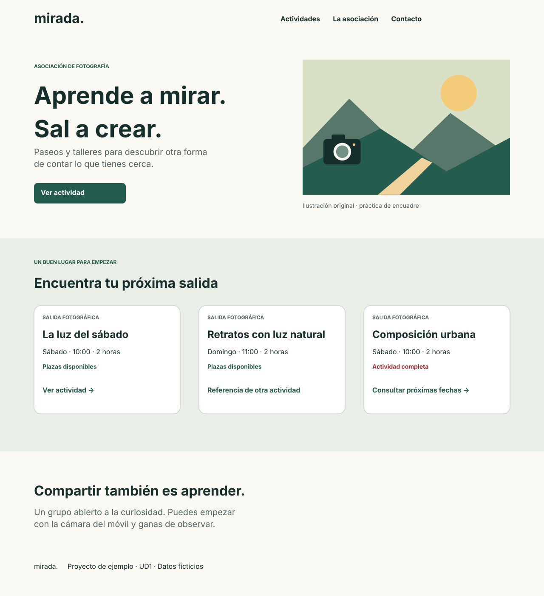](ejemplo-mirada/recursos/05-inicio.svg)

El recorrido interactivo resuelto se centra en **«La luz del sábado»**. Las otras tarjetas permiten practicar repetición y estados; no representan actividades con todos sus detalles desarrollados.

## Qué se trabaja y dónde

Cada apartado de la unidad tiene su aplicación en este ejemplo. Los enlaces de la primera columna llevan a los apuntes; los de la última, al paso concreto de Mirada.

| Apartado de UD1 | Aplicación en Mirada | Pasos del ejemplo |
|---|---|---|
| [Planificación](<planificación.md>) | Del encargo y los perfiles al inventario, el mapa, el flujo y la prueba de tarea. | [Paso 2: Escribir y entender el brief](#paso-2-escribir-y-entender-el-brief) · [Paso 3: Del brief al inventario de contenido](#paso-3-del-brief-al-inventario-de-contenido) · [Paso 4: Del brief al mapa y al flujo](#paso-4-del-brief-al-mapa-y-al-flujo) · [Paso 35: Realizar una prueba de tarea](#paso-35-realizar-una-prueba-de-tarea) |
| [Estructura](<Componentes de un interfaz web.md>) | Identificación, navegación, contenido e interacción en las pantallas amplias y estrechas. | [Paso 4: Del brief al mapa y al flujo](#paso-4-del-brief-al-mapa-y-al-flujo) · [Paso 17: Crear enlaces y cabecera](#paso-17-crear-enlaces-y-cabecera) · [Paso 19: Montar el inicio amplio](#paso-19-montar-el-inicio-amplio) · [Paso 20: Adaptar el inicio estrecho](#paso-20-adaptar-el-inicio-estrecho) · [Paso 21: Diseñar el detalle](#paso-21-disenar-el-detalle) · [Paso 22: Representar solicitud y error](#paso-22-representar-solicitud-y-error) · [Paso 23: Diseñar la confirmación](#paso-23-disenar-la-confirmacion) |
| [Principios visuales](<elementosDiseño.md>) | Jerarquía, proximidad, semejanza, figura/fondo, simetría, continuidad y cierre aplicados a la composición. | [Paso 5: Comparar dos bocetos](#paso-5-comparar-dos-bocetos) · [Paso 19: Montar el inicio amplio](#paso-19-montar-el-inicio-amplio) · [Paso 27: Añadir un velo para el texto](#paso-27-anadir-un-velo-para-el-texto) · [Paso 29: Probar superposición](#paso-29-probar-superposicion) · [Paso 30: Practicar tensión, cierre y edición vectorial](#paso-30-practicar-tension-cierre-y-edicion-vectorial) |
| [Color, tipografía e iconos](<colorTipografíaIconos.md>) | Paleta por función, modelos de color, contraste, estilos de texto, espaciado e iconos. | [Paso 7: Crear los colores por función](#paso-7-crear-los-colores-por-funcion) · [Paso 8: Comprobar contraste](#paso-8-comprobar-contraste) · [Paso 9: Crear estilos tipográficos](#paso-9-crear-estilos-tipograficos) · [Paso 10: Ensayar longitud y espaciado](#paso-10-ensayar-longitud-y-espaciado) · [Paso 11: Importar y normalizar iconos](#paso-11-importar-y-normalizar-iconos) |
| [Figma y composición](<EmpezarFigma.md>) | Archivo, frames, guías, imágenes, recortes, máscaras, velo, soft crop, superposición y tensión. | [Paso 1: Crear el archivo y el espacio de trabajo](#paso-1-crear-el-archivo-y-el-espacio-de-trabajo) · [Paso 6: Crear los frames y las guías](#paso-6-crear-los-frames-y-las-guias) · [Paso 24: Importar el paisaje](#paso-24-importar-el-paisaje) · [Paso 25: Recortar sin deformar](#paso-25-recortar-sin-deformar) · [Paso 26: Crear una máscara](#paso-26-crear-una-mascara) · [Paso 27: Añadir un velo para el texto](#paso-27-anadir-un-velo-para-el-texto) · [Paso 28: Crear soft crop con degradado](#paso-28-crear-soft-crop-con-degradado) · [Paso 29: Probar superposición](#paso-29-probar-superposicion) · [Paso 30: Practicar tensión, cierre y edición vectorial](#paso-30-practicar-tension-cierre-y-edicion-vectorial) |
| [Componentes](<Componentes_Figma.md>) | Auto Layout, variantes, instancias, estados, prototipo y microinteracciones. | [Paso 12: Crear un botón con Auto Layout](#paso-12-crear-un-boton-con-auto-layout) · [Paso 13: Separar tipo y estado](#paso-13-separar-tipo-y-estado) · [Paso 14: Probar instancias](#paso-14-probar-instancias) · [Paso 15: Construir la tarjeta de actividad](#paso-15-construir-la-tarjeta-de-actividad) · [Paso 16: Crear campo, etiqueta, ayuda y error](#paso-16-crear-campo-etiqueta-ayuda-y-error) · [Paso 17: Crear enlaces y cabecera](#paso-17-crear-enlaces-y-cabecera) · [Paso 18: Montar la página de componentes](#paso-18-montar-la-pagina-de-componentes) · [Paso 31: Conectar las pantallas](#paso-31-conectar-las-pantallas) · [Paso 32: Añadir una microinteracción](#paso-32-anadir-una-microinteraccion) · [Paso 33: Ensayar una ventana superpuesta](#paso-33-ensayar-una-ventana-superpuesta) · [Paso 34: Revisar animación y desplazamiento](#paso-34-revisar-animacion-y-desplazamiento) |
| [Recorrido de clase](<guiaUnidad.md>) | Sitúa el trabajo desde la preparación hasta la revisión y la continuidad del proyecto. | [Paso 1: Crear el archivo y el espacio de trabajo](#paso-1-crear-el-archivo-y-el-espacio-de-trabajo) · [Paso 35: Realizar una prueba de tarea](#paso-35-realizar-una-prueba-de-tarea) · [Paso 38: Transferir al proyecto de la actividad 21](#paso-38-transferir-al-proyecto-de-la-actividad-21) |
| [Objetivos y criterios](<objetivos.md>) | Comprueba el resultado, prepara los recursos y relaciona lo aprendido con el proyecto propio. | [Paso 36: Comprobar el resultado](#paso-36-comprobar-el-resultado) · [Paso 37: Compartir y exportar](#paso-37-compartir-y-exportar) · [Paso 38: Transferir al proyecto de la actividad 21](#paso-38-transferir-al-proyecto-de-la-actividad-21) |
| [Actividades](<Actividades.md>) | Transfiere las técnicas a la actividad 21; Mirada es un ejemplo sin entrega. | [Paso 38: Transferir al proyecto de la actividad 21](#paso-38-transferir-al-proyecto-de-la-actividad-21) |
| [Apoyo · DesignPro](<Tutorial_Figma_DesignPro.md>) | Compara el sistema visual, la cabecera y la composición con otro ejemplo de apoyo. | [Paso 7: Crear los colores por función](#paso-7-crear-los-colores-por-funcion) · [Paso 9: Crear estilos tipográficos](#paso-9-crear-estilos-tipograficos) · [Paso 17: Crear enlaces y cabecera](#paso-17-crear-enlaces-y-cabecera) · [Paso 19: Montar el inicio amplio](#paso-19-montar-el-inicio-amplio) · [Paso 20: Adaptar el inicio estrecho](#paso-20-adaptar-el-inicio-estrecho) |

Las reglas de alineación y consistencia se aplican según la función: una página puede combinar bloques alineados a la izquierda y otros centrados si la relación es clara. Las medidas de este ejercicio son decisiones de diseño, no reglas universales.

## Bloque 1 · Comprender y organizar

### Paso 1. Crear el archivo y el espacio de trabajo

**Referencia de UD1:** [Figma y composición](<EmpezarFigma.md>).

1. Entra en https://www.figma.com desde el navegador y crea un archivo de **Figma Design** y llámalo `UD1 · Mirada · Tu versión`.
2. Trabaja en una sola página para no depender de límites de páginas del plan.
3. Crea secciones llamadas `01 Investigación`, `02 Bocetos`, `03 Sistema`, `04 Componentes`, `05 Pantallas` y `06 Pruebas`.
4. Deja separación entre secciones. Nombra las capas al crearlas: `Título`, `Descripción`, `Acción`, `Imagen`.

**Comprueba:** puedes localizar cada grupo sin depender del orden en que lo dibujaste.

### Paso 2. Escribir y entender el brief

**Referencia de UD1:** [Planificación](<planificación.md>).

#### 2.1. Qué es un brief y para qué lo hacemos

Un **brief es un documento breve que explica el encargo antes de diseñar**. Responde a estas preguntas: ¿qué problema vamos a resolver?, ¿para quién?, ¿qué debe poder hacer esa persona?, ¿qué vamos a entregar? y ¿qué falta por averiguar?

Sirve para tomar decisiones y comprobar que el diseño responde al encargo. Si después no sabemos si incluir un calendario, una galería o un botón, volvemos al brief y preguntamos qué tarea ayuda a resolver. El color, la tipografía y las medidas se concretarán en la guía visual; no hace falta decidirlos ahora.

En un trabajo real, el equipo prepara el brief con quien encarga la web y lo revisa con la información disponible. **En esta práctica tú actúas como diseñador y Mirada es una asociación ficticia.** El caso proporciona un punto de partida para aprender; no procede de entrevistas realizadas.

#### 2.2. El encargo de Mirada, explicado como una situación

Imagina que Mirada organiza salidas para practicar fotografía con el móvil. Para este ejercicio suponemos que anuncia sus actividades en distintos mensajes y carteles. Una persona interesada encuentra el título de una salida, pero tiene que buscar en otro sitio el horario, el material y cómo participar.

La asociación plantea este encargo ficticio:

> Queremos reunir la información de nuestras salidas para que una persona pueda elegir una, conocer sus requisitos y entender cómo solicitar participar.

La web tiene dos destinatarios del beneficio: la asociación quiere comunicar mejor sus actividades y la persona visitante quiere decidir si puede asistir. En UD1 diseñaremos ese recorrido en Figma. No construiremos todavía un sistema de reservas.

**Qué te da el ejercicio:** el tema, la actividad «La luz del sábado» y una propuesta de recorrido. **Qué tienes que razonar tú:** qué información necesita la persona, cómo se organiza, qué debe comunicar cada pantalla y cómo comprobarás que se entiende.

#### 2.3. Completar cada apartado con una razón

**A. Proyecto y encargo: quién pide qué.**

Escribe: «Mirada, asociación ficticia de fotografía. Diseñaremos una web para consultar salidas y representar cómo solicitar participar». Así identificamos la organización y el servicio. «Hacer una web moderna» es demasiado impreciso: no explica qué debe resolver.

**B. Problema: qué dificultad encuentra la persona.**

Escribe: «En el supuesto del ejercicio, la información está dispersa y cuesta reunir horario, lugar, material y forma de participación». Esto explica una dificultad concreta. No escribas únicamente «la asociación no tiene web»: la ausencia de una web no explica por sí sola la necesidad.

De aquí sale una primera decisión: los datos de una actividad deben poder consultarse juntos. Todavía no hemos decidido su color ni su posición exacta.

**C. Objetivo: qué queremos facilitar.**

Escribe: «Que la persona pueda localizar una salida, decidir si le encaja y comprender el proceso de solicitud». Es un resultado esperado para el diseño, no un resultado demostrado. «Conseguir un 30 % más de inscripciones» no sería una conclusión justificada: no tenemos datos de partida ni una web en funcionamiento.

**D. Usuarios y contexto: quién realiza la tarea y en qué situación.**

| Perfil ficticio | Situación y necesidad | Consecuencia para el diseño |
|---|---|---|
| Persona que visita por primera vez | Consulta desde el móvil y no sabe si necesita una cámara profesional | Explicar nivel, material, horario y forma de participar con lenguaje claro |
| Persona que ya conoce Mirada | Quiere localizar una próxima salida y revisar sus datos | Facilitar el acceso a las actividades y distinguir título, fecha y disponibilidad |

No es necesario inventar apellidos, edad exacta o estado civil. Incluye características que cambien una decisión. Los perfiles son hipótesis de trabajo: una persona que ya conoce Mirada también puede usar el móvil.

**E. Tareas: qué quiere conseguir la persona.**

1. Encontrar una salida que le interese.
2. Averiguar cuándo se realiza, dónde y qué necesita llevar para decidir si puede asistir.
3. Comprender cómo solicitar participar y reconocer el resultado del recorrido simulado.

«Pulsar el botón verde» describe una operación del diseño, no la necesidad. La persona quiere participar; todavía no sabe de qué color será el botón ni dónde estará.

La **tarea principal** que resolveremos de principio a fin es: «Consultar La luz del sábado y recorrer una solicitud simulada». Las tareas anteriores la descomponen en partes que podemos observar.

**F. Contenido: qué información necesitamos redactar.**

Para cada actividad necesitamos título, descripción, fecha/horario, duración, lugar, material, disponibilidad y forma de participación. La interfaz no puede mostrar una dirección que nadie ha proporcionado.

La lámina utiliza «Sábado · 10:00–12:00» y «Punto de encuentro de la asociación» como textos de práctica. **Faltan la fecha de calendario y una dirección concreta.** Anótalas como pendientes; esos textos permiten trabajar la composición, pero no bastarían para publicar una convocatoria real.

**G. Requisitos: qué debe permitir o comunicar el diseño.**

Una necesidad explica por qué; un requisito concreta qué debe resolver la interfaz. Una solución visual es una manera posible de cumplirlo.

| Necesidad | Requisito del ejercicio | Posible solución, que habrá que comprobar |
|---|---|---|
| Saber si puedo asistir | Mostrar horario, lugar y material antes de pedir la solicitud | Agrupar esos datos en el detalle de actividad |
| Localizar una salida | Identificar las actividades y permitir abrir una | Tarjetas con títulos y acciones comprensibles |
| Usar el móvil | Mantener información y acciones legibles en ancho estrecho | Reorganizar las tarjetas en una columna |
| Entender un error | Mostrar qué dato hay que revisar y cómo continuar | Etiqueta y mensaje textual junto al correo simulado |
| Saber qué ha ocurrido | Distinguir error de finalización del recorrido | Estado de confirmación que indique expresamente la simulación |

No confundas las tres columnas: una tarjeta es una propuesta de presentación, no una necesidad del usuario. Podrías cumplir parte del requisito mediante otra distribución.

**H. Alcance: qué diseñaremos y con qué nivel de detalle.**

- **Inicio:** versión amplia y estrecha, con presentación y acceso a actividades.
- **Detalle de La luz del sábado:** datos necesarios para decidir y acción «Solicitar plaza».
- **Solicitud:** representación de los campos y de un estado de error.
- **Confirmación:** explicación de que el recorrido es simulado y opción de volver.

Las otras tarjetas sirven para practicar repetición y disponibilidad; no se diseñan todos sus detalles. El recorrido de referencia utiliza pantallas secundarias amplias; completar sus versiones estrechas es una ampliación. Tampoco necesitamos una página independiente para cada sección del inicio.

**Fuera del alcance de UD1:** reservas reales, pagos, cuentas de usuario, gestión de plazas, envío de correos y almacenamiento de datos. «Solicitar plaza» es el texto de una acción en el prototipo; no significa que se reserve una plaza real.

**I. Condiciones y entregables: con qué trabajamos y qué tendremos al terminar.**

Trabajaremos con Figma, contenido ficticio y recursos cuya procedencia esté documentada. Conservaremos brief, inventario, mapa, bocetos, guía visual, componentes, prototipo y registro de revisión. No hace falta programar estas pantallas en UD1.

La referencia usa nombre ficticio y correo para practicar campos. La necesidad de pedir el nombre y la obligatoriedad de cada dato deben justificarse al convertir el caso en un servicio real; no se deducen automáticamente de la maqueta.

**J. Hipótesis, dudas y comprobación.**

La frase «la fecha es el primer dato que se consulta» es una hipótesis, no un hecho. Para contrastarla, plantea: «Elige una salida a la que podrías asistir y explica qué información necesitas». Observa qué consulta la persona sin indicarle que mire la fecha.

Podremos comprobar si localiza una actividad, encuentra material y horario sin ayuda, entiende qué hacer ante el error y reconoce la simulación al terminar. Esta prueba revisa el prototipo. No demuestra que una asociación real vaya a recibir más solicitudes ni sustituye una investigación con su público objetivo.

#### 2.4. Brief redactado de Mirada

Este es el documento de partida que puedes colocar en `01 Investigación`. Es una versión inicial revisable, no un texto que debas memorizar.

> **Proyecto y encargo.** Mirada es una asociación ficticia que organiza salidas para practicar fotografía. El encargo consiste en diseñar una web que reúna la información de las actividades y represente cómo solicitar participar.
>
> **Problema y objetivo.** En el supuesto del ejercicio, los datos están dispersos entre mensajes y carteles. Queremos facilitar que una persona encuentre una salida, comprenda sus requisitos y decida si le encaja antes de iniciar una solicitud.
>
> **Usuarios.** Trabajamos con dos perfiles hipotéticos: quien visita por primera vez desde el móvil y necesita orientación, y quien ya conoce la asociación y quiere consultar otra salida.
>
> **Tarea principal.** Consultar «La luz del sábado», averiguar horario, lugar y material, y recorrer una solicitud simulada. Las acciones deben permitir volver si la actividad no encaja.
>
> **Contenido y requisitos.** Mostraremos título, descripción, horario, duración, lugar, material y disponibilidad. El diseño debe ser legible en ancho estrecho, identificar las acciones, explicar un error de correo y distinguir la finalización simulada de una reserva real.
>
> **Alcance y entrega.** En Figma diseñaremos inicio amplio/estrecho, detalle de una actividad y estados de solicitud, error y confirmación. Entregaremos también los documentos y recursos que justifican el prototipo. Las pantallas secundarias estrechas quedan como ampliación.
>
> **Límites.** No habrá cuentas, pagos, reserva efectiva, envío ni almacenamiento de datos. Usaremos datos ficticios y documentaremos la procedencia de los recursos.
>
> **Pendientes y prueba.** La fecha completa y la dirección de encuentro aún deben concretarse. Suponemos que el horario influye en la elección; observaremos una tarea sin dar pistas para revisar esa hipótesis y comprobar si se entienden los datos, las acciones y los estados.

#### 2.5. Cómo lo llevas a Figma

1. En `01 Investigación`, crea un frame llamado `Brief · Mirada · v1`.
2. Añade los títulos «Encargo», «Problema y objetivo», «Usuarios», «Tarea», «Requisitos y contenido», «Alcance» y «Pendientes y prueba».
3. Escribe el contenido anterior con tus palabras, en bloques legibles. Puedes redactarlo primero en un documento y llevar después el resumen a Figma.
4. Añade la nota `Caso ficticio de aula; investigación real no realizada`.
5. Al cambiar una decisión importante, conserva la versión y anota qué cambia y por qué.

La lámina de planificación es un resumen visual del caso; este texto explica el razonamiento que no cabe en ella. No es necesario encajar todo el brief en las pequeñas cajas de la lámina.

**Comprueba antes de avanzar:** puedes explicar el problema sin hablar de colores; cada perfil tiene una tarea; sabes qué pantallas vas a diseñar y qué no funcionará realmente; y distingues los datos del caso de las hipótesis y los pendientes. Copiar un texto sin poder explicarlo no completa este paso.

### Paso 3. Del brief al inventario de contenido

**Referencia de UD1:** [Planificación](<planificación.md>) · [Estructura](<Componentes de un interfaz web.md>).

Ahora convertimos «necesitamos informar sobre una salida» en textos que podamos colocar en las pantallas. El brief explica por qué hacen falta; el inventario recoge cuáles son y dónde los utilizaremos.

| Dato | Contenido de práctica para Mirada | Uso y estado |
|---|---|---|
| Propuesta | Aprende a mirar. Sal a crear. | Presentación del inicio; expresa la actividad de la asociación |
| Título | La luz del sábado | Tarjeta, detalle y solicitud; permite reconocer la misma actividad |
| Descripción | Practica encuadre, luz y composición con tu móvil | Detalle; explica qué se hará |
| Horario | Sábado · 10:00–12:00 | Tarjeta y detalle; falta concretar una fecha de calendario |
| Duración | 2 horas | Ayuda a decidir si se puede asistir |
| Lugar | Punto de encuentro de la asociación | Texto provisional de la lámina; falta una dirección útil |
| Material | Móvil con cámara y libreta | Detalle; responde a la duda sobre el equipo necesario |
| Disponibilidad | Plazas disponibles en este ejemplo | Estado ficticio, no conectado a un sistema de reservas |
| Acción | Solicitar plaza | Abre la representación de la solicitud |
| Finalización | Solicitud simulada; no se envían datos ni se reserva una plaza | Informa del alcance real de la práctica |

Crea esta tabla en un documento o en un frame de investigación. Identifica los textos pendientes en una columna; no los completes con datos reales inventados. Si introduces una fecha y un lugar ficticios para tu variante de clase, márcalos como datos de prueba y utilízalos de forma consistente.

Recupera las tres tareas del brief: encontrar la salida, averiguar sus requisitos y comprender la solicitud. Para cada una, señala qué filas de la tabla necesita la persona. Así sabrás qué información no puede faltar al diseñar.

**Comprueba:** cada dato tiene una función y los textos coinciden entre tarjeta, detalle y solicitud. Evita Lorem ipsum en la información que permite tomar decisiones.

### Paso 4. Del brief al mapa y al flujo

**Referencia de UD1:** [Planificación](<planificación.md>) · [Estructura](<Componentes de un interfaz web.md>).

Son tres documentos relacionados, pero responden a preguntas distintas:

| Documento | Pregunta | Ejemplo |
|---|---|---|
| Brief | ¿Qué problema resolvemos y hasta dónde llegamos? | Consultar una salida y comprender una solicitud simulada |
| Mapa | ¿Qué pantallas hay y cómo se relacionan? | Inicio, detalle y solicitud |
| Flujo | ¿Qué pasos y decisiones hay al intentar la tarea? | Leer requisitos, decidir, solicitar, revisar un error y continuar |

En este ejemplo, **Actividades es una sección del inicio**. Abrir una tarjeta lleva al detalle. Error y confirmación son estados del recorrido, aunque los dibujemos como frames separados para simularlos en Figma.

```text
Mapa del prototipo
Inicio
└── Sección Actividades
    └── Detalle de La luz del sábado
        └── Solicitud
            ├── Estado de error
            └── Confirmación simulada
```

El flujo añade las decisiones:

```text
Ver actividades → Abrir La luz del sábado → Leer datos y requisitos
  ├── No encaja → Volver al inicio y consultar otra actividad
  └── Encaja → Abrir solicitud simulada
       ├── Representar correo incompleto → Ver error → Simular corrección
       └── Simular datos completos → Ver confirmación → Volver al inicio
```

No hace falta que cada caja sea una página HTML independiente cuando implementes el proyecto: en una web real, un error puede aparecer dentro del mismo formulario. En Figma usamos distintos frames para mostrar el estado. La referencia tiene enlaces didácticos que simulan completar o corregir datos; no evalúa lo que una persona escribe.

[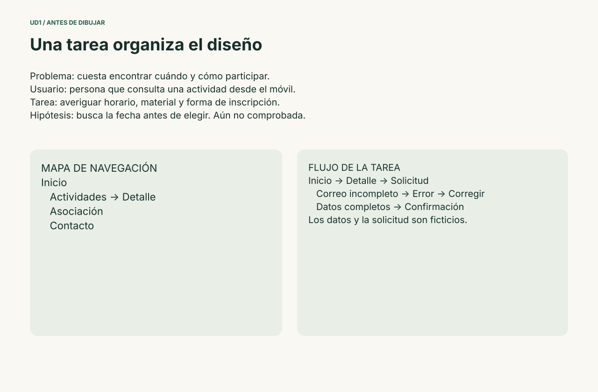](ejemplo-mirada/recursos/01-planificacion.svg)

**Comprueba:** una persona puede señalar de dónde viene cada pantalla. El detalle responde a «necesito decidir», la solicitud a «quiero participar» y los estados a «necesito entender qué ha ocurrido». El siguiente paso será comparar cómo distribuir esa información, todavía sin decidir la paleta.


## Bloque 2 · Explorar el diseño

### Paso 5. Comparar dos bocetos

**Referencia de UD1:** [Principios visuales](<elementosDiseño.md>).

1. Dibuja dos versiones del inicio en escala de grises, sin seleccionar aún una paleta.
2. En A, coloca una imagen grande antes de los datos.
3. En B, presenta propuesta, información y acción antes de la imagen.
4. Identifica qué debe verse primero, segundo y tercero.
5. Elige B como hipótesis de este ejemplo; escribe qué tarea esperas facilitar.

[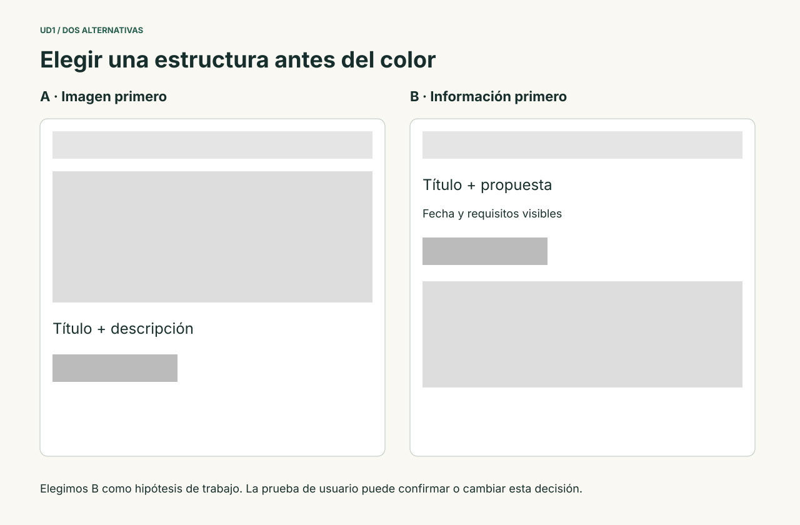](ejemplo-mirada/recursos/02-bocetos.svg)

La **proximidad** une fecha y actividad; la **semejanza** agrupa tarjetas; la **continuidad** alinea títulos y acciones. La **figura/fondo** separa contenido y decoración. Compara una composición simétrica y otra asimétrica: la elección se justifica por el contenido, no por una obligación de centrarlo todo.

### Paso 6. Crear los frames y las guías

**Referencia de UD1:** [Figma y composición](<EmpezarFigma.md>).

1. En `05 Pantallas`, crea `Inicio / Amplio`, de **1280 × 1400 px**.
2. Añade una guía de **12 columnas**, tipo Stretch, margen **80 px** y gutter **24 px**. Puede aparecer como Layout grid o Layout guides según la interfaz.
3. El área de contenido mide `1280 − 80 − 80 = 1120 px`. Las guías ayudan a alinear; no distribuyen por sí mismas los hijos.
4. Crea `Inicio / Estrecho`, de **390 × 1680 px**, con **4 columnas**, margen **24 px** y gutter **16 px**.
5. Oculta y muestra las guías para comparar la composición con y sin ellas.

**Comprueba:** conoces la diferencia entre guías de columnas y Auto Layout. La altura de los frames es una referencia inicial; puede crecer si cambia el contenido.

### Paso 7. Crear los colores por función

**Referencia de UD1:** [Color, tipografía e iconos](<colorTipografíaIconos.md>).

En `03 Sistema`, crea una muestra por rol y guarda estilos de color locales desde el relleno. Usa estos nombres y valores:

| Rol | HEX | Uso |
|---|---|---|
| Texto | `#172F2C` | Títulos y párrafos principales |
| Acción | `#245C4D` | Botón principal y enlaces |
| Acción/hover | `#174438` | Respuesta al puntero |
| Fondo | `#FAF8F2` | Página |
| Superficie | `#FFFFFF` | Tarjetas y campos |
| Fondo/apoyo | `#E9EFE7` | Agrupación de contenido |
| Acento | `#DFEAAB` | Decoración y énfasis moderado |
| Texto/secundario | `#52665F` | Ayuda y contexto |
| Foco | `#8B3B00` | Contorno de foco de controles |
| Error | `#A02B31` | Error acompañado de texto |
| Borde/decorativo | `#B7C6BF` | Separación de tarjetas; no usar como única señal de un campo |

Escribe el rol junto a cada muestra. Identifica un mismo color en HEX y RGB usando el selector de color. HSL se explica en los apuntes; si el selector ofrece HSB, recuerda que **B y L no son la misma magnitud**. CMY se reserva aquí a la comparación con reproducción impresa, no a configurar el color de la interfaz.

### Paso 8. Comprobar contraste

**Referencia de UD1:** [Color, tipografía e iconos](<colorTipografíaIconos.md>).

1. Comprueba Texto/Fondo, blanco/Acción y Error/Fondo con una herramienta de contraste.
2. Anota los valores obtenidos y el contexto de uso.
3. Para texto normal usa como referencia 4,5:1 y para texto grande 3:1 según la definición de WCAG.
4. Comprueba también el foco y el estado hover; acompaña el error con una explicación.

La tabla del paquete `contrastes.json` contiene cálculos de pares planos. No demuestra contraste sobre una imagen variable ni conformidad completa. [Referencia WCAG](https://www.w3.org/WAI/WCAG22/quickref/).

### Paso 9. Crear estilos tipográficos

**Referencia de UD1:** [Color, tipografía e iconos](<colorTipografíaIconos.md>).

Selecciona **Inter**, Regular y Bold. Crea estilos con tamaño/interlineado explícitos:

| Nombre | Tamaño / interlineado | Uso |
|---|---|---|
| Título/amplio | 56 / 78,4 px | Propuesta del inicio |
| Título/estrecho | 36 / 50,4 px | Propuesta móvil |
| Sección | 32 / 44,8 px | Bloques de contenido |
| Tarjeta | 24 / 33,6 px | Título de actividad |
| Cuerpo | 16 / 22,4 px | Información general |
| Ayuda | 14 / 19,6 px | Texto de apoyo |
| Etiqueta | 12 / 16,8 px | Categoría breve |

Esta referencia utiliza interlineado 1,4 para mantener una referencia consistente. Ajustarlo después exige comprobar la composición. El tamaño de un título no determina su nivel semántico en HTML.

### Paso 10. Ensayar longitud y espaciado

**Referencia de UD1:** [Color, tipografía e iconos](<colorTipografíaIconos.md>).

1. Crea un párrafo de dos o tres líneas y compara anchos de 520 y 340 px.
2. Cuenta **caracteres**, no palabras, en una línea representativa.
3. Duplica el párrafo y compara interlineado 1,4 y 1,6.
4. Prueba un pequeño espaciado entre letras en la etiqueta de categoría; no lo apliques automáticamente al cuerpo.
5. Documenta una escala de espacios: **8, 16, 24, 32, 48 y 64 px**.

[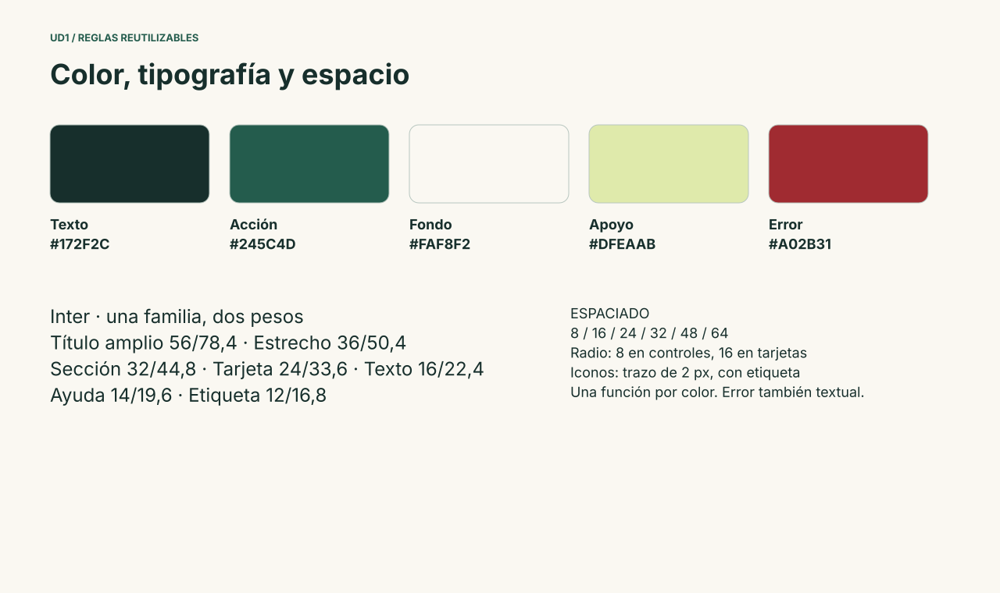](ejemplo-mirada/recursos/03-sistema.svg)

### Paso 11. Importar y normalizar iconos

**Referencia de UD1:** [Color, tipografía e iconos](<colorTipografíaIconos.md>).

Arrastra `camara.svg`, `flecha.svg`, `menu.svg` y `cerrar.svg` desde el paquete. Son recursos vectoriales originales del ejemplo, con caja de 24 × 24 y trazo de 2 px.

1. Comprueba que conservan el mismo tamaño y grosor.
2. Convierte cada uno en componente.
3. Coloca una instancia junto a una etiqueta, por ejemplo «Menú».
4. Separa los iconos que comunican una acción de los que solo decoran.

La marca `mirada.` se construye con texto; el icono no sustituye la identificación del sitio.

## Bloque 3 · Construir componentes

### Paso 12. Crear un botón con Auto Layout

**Referencia de UD1:** [Componentes](<Componentes_Figma.md>).

1. Escribe `Consultar actividad` con Inter Bold de 16 px.
2. Selecciona el texto y aplica **Auto Layout**. El resultado debe ser un frame que contiene el texto, no un grupo de rectángulo y texto independientes.
3. Usa dirección horizontal, relleno vertical de 12 px, horizontal de 16 px y alineación centrada.
4. Configura el ancho para ajustarse al contenido (**Hug contents**) y radio de 8 px.
5. Aplica Acción al fondo y blanco al texto.
6. Convierte el frame en componente y nómbralo `Botón`.

El botón con Auto Layout ajusta su ancho al texto. Una diferencia de ancho respecto a la lámina puede ser el resultado correcto de Hug contents.

### Paso 13. Separar tipo y estado

**Referencia de UD1:** [Componentes](<Componentes_Figma.md>).

Crea variantes del botón. Define `Tipo=Primario/Secundario` y `Estado=Normal/Hover/Foco/Deshabilitado` para las combinaciones que necesites.

- Primario normal: fondo Acción y texto blanco.
- Hover: fondo Acción/hover, sin cambiar el tamaño del texto.
- Foco: contorno exterior de 3 px en el color Foco, reconocible sobre el fondo.
- Deshabilitado: fondo apagado y explicación de por qué no está disponible.
- Secundario: fondo de página, borde y texto Acción.

La referencia incluye cuatro estados primarios y dos secundarios. No hace falta generar todas las combinaciones si no se van a utilizar.

### Paso 14. Probar instancias

**Referencia de UD1:** [Componentes](<Componentes_Figma.md>).

1. Crea dos instancias del botón.
2. Cambia el texto de una a `Consultar todas las actividades`.
3. Cambia el radio en el componente principal y observa las instancias.
4. Restaura el radio del sistema.
5. Comprueba que no has usado **Detach instance** para cambiar el texto.

**Resultado esperado:** contenido distinto con la misma definición visual. Un cambio de texto no necesita una nueva variante.

### Paso 15. Construir la tarjeta de actividad

**Referencia de UD1:** [Componentes](<Componentes_Figma.md>).

1. Crea un frame vertical de **344 px de ancho**, padding de **20 px** y separación de **16 px**.
2. Añade categoría, título, fecha, disponibilidad y acción.
3. Usa `Fill container` para el ancho de los textos dentro del frame y altura que permita mostrar el contenido.
4. Aplica superficie blanca, radio de 16 px y borde decorativo.
5. Convierte el frame en componente `Tarjeta`.
6. Crea variantes `Disponible` y `Completa`. La segunda debe mostrar literalmente «Actividad completa».
7. Crea una instancia con `Retratos con luz natural` y otra con un título largo.

La lámina reserva una altura inicial de 254 px. Si un título largo ya no cabe, cambia la tarjeta a **Hug contents** y verifica sus hermanas: no ocultes el texto para mantener una altura arbitraria.

### Paso 16. Crear campo, etiqueta, ayuda y error

**Referencia de UD1:** [Componentes](<Componentes_Figma.md>).

1. Crea un frame de unos **344 px de ancho**.
2. Añade la etiqueta `Correo de prueba` y un control de 48 px de altura con radio 8.
3. Usa un borde Acción para identificar el control; el borde decorativo claro se reserva para separación no esencial.
4. Coloca debajo `Usa datos ficticios` como ayuda.
5. Crea variantes Normal, Foco y Error; Foco añade un contorno de 3 px en el color Foco.
6. En Error, muestra `persona@` y el mensaje `Escribe un correo completo`, además del color de error.

**Comprueba:** el campo tiene una etiqueta visible incluso cuando hay texto escrito. La variante no es un campo HTML real ni admite automáticamente escritura.

### Paso 17. Crear enlaces y cabecera

**Referencia de UD1:** [Componentes](<Componentes_Figma.md>).

1. Crea un componente `Enlace` con estados Normal, Actual y Foco.
2. Actual utiliza un indicador adicional al color; Foco tiene contorno.
3. Construye una cabecera de 1280 × 88 con marca a la izquierda y navegación a la derecha.
4. Crea otra variante de 390 × 80 con marca y control `Menú`.
5. Mantén tipografía, nombres y función entre variantes.

La referencia mantiene la geometría de ambas cabeceras como variantes independientes. Para practicar la distribución, reconstruye el interior con Auto Layout horizontal y espacio entre marca y navegación.

### Paso 18. Montar la página de componentes

**Referencia de UD1:** [Componentes](<Componentes_Figma.md>).

[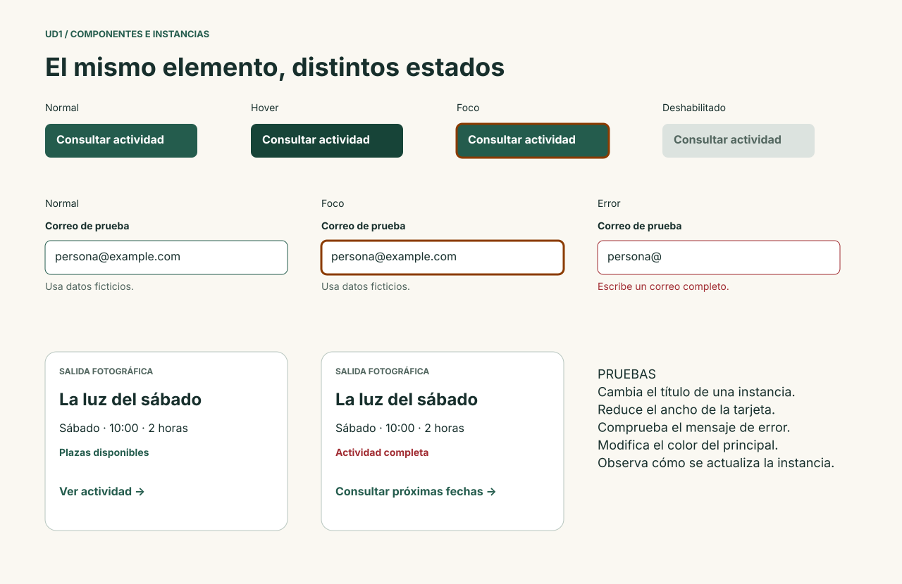](ejemplo-mirada/recursos/04-componentes.svg)

Coloca principales en `04 Componentes` e instancias en las pantallas. Documenta el propósito de cada variante. Añade una ficha: nombre, contenido, estados, reglas y pruebas. Conserva una instancia con contenido largo para revisar futuros cambios del sistema.

## Bloque 4 · Construir pantallas

### Paso 19. Montar el inicio amplio

**Referencia de UD1:** [Estructura](<Componentes de un interfaz web.md>) · [Principios visuales](<elementosDiseño.md>).

Coloca instancias y contenido en el frame de 1280. Usa esta guía de posición como punto de partida:

| Bloque | Posición y medida de referencia |
|---|---|
| Cabecera | x=0, y=0, 1280 × 88 |
| Etiqueta principal | x=80, y=148 |
| Título | x=80, y=188, ancho 600 |
| Descripción | x=80, y=344, ancho 570 |
| Acción | x=80, y=430 |
| Imagen | x=712, y=140, 488 × 318 |
| Fondo de actividades | x=0, y=560, 1280 × 500 |
| Tarjetas | x=80/468/856, y=718; ancho 344 |
| Asociación | desde x=80, y=1132 |
| Pie | x=80, y=1320 |

Las tarjetas se distribuyen en una fila de 1120 px con huecos de 44 px: `3 × 344 + 2 × 44 = 1120`. La fila usa la guía exterior; no todos sus bordes tienen que coincidir con una columna de la retícula de 12.

**Comprueba:** propuesta y acción se reconocen primero. Fecha y disponibilidad pertenecen visualmente a la misma tarjeta. El fondo agrupa actividades y deja claro el cambio de sección.

### Paso 20. Adaptar el inicio estrecho

**Referencia de UD1:** [Estructura](<Componentes de un interfaz web.md>) · [Figma y composición](<EmpezarFigma.md>).

[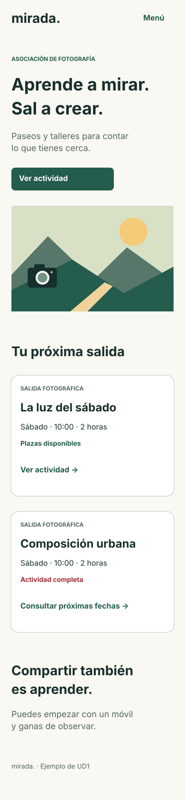{ width="320" }](ejemplo-mirada/recursos/06-movil.svg)

1. Usa el frame de 390 px y márgenes de 24 px.
2. Cambia la cabecera por la variante estrecha.
3. Usa el título de 36 px y coloca imagen después de texto y acción.
4. Dispón las tarjetas en una columna; la referencia muestra dos para simplificar la lámina. En tu versión puedes incluir las tres aumentando la altura.
5. Comprueba que no reduces todo el diseño de escritorio mediante Scale.
6. Usa una altura de contenido suficiente y configura el viewport de presentación según necesites comprobar el scroll.

La referencia de 344 px de tarjeta deja 23 px por lado. Puedes ajustar a 342 px para respetar exactamente los márgenes de 24 px; comprueba el contenido después de hacerlo.

### Paso 21. Diseñar el detalle

**Referencia de UD1:** [Estructura](<Componentes de un interfaz web.md>).

Crea un frame de 1280 × 850. Reutiliza cabecera, tipografía y botón. Añade título, descripción, imagen y estos datos: fecha, lugar, material y disponibilidad. La acción se llama `Solicitar plaza`.

[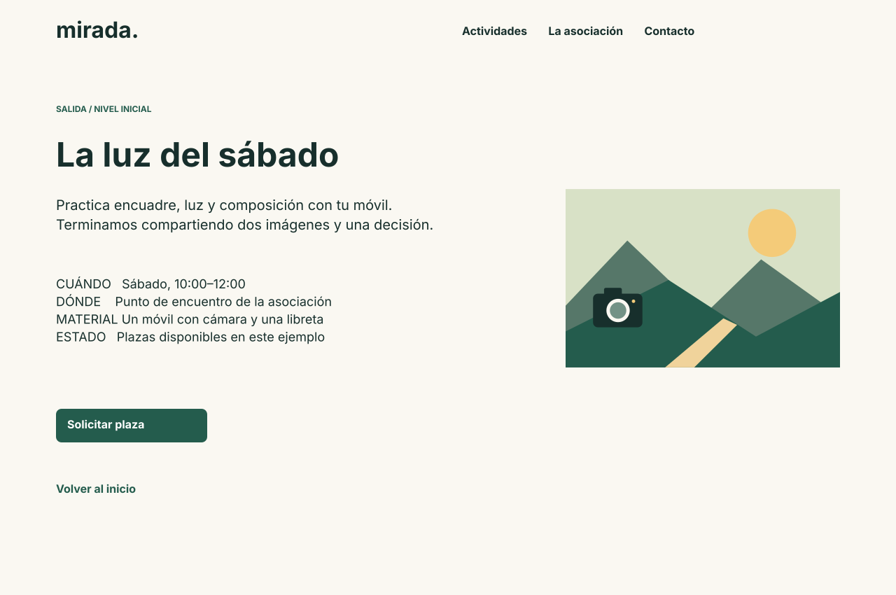](ejemplo-mirada/recursos/07-detalle.svg)

**Comprueba:** la persona puede decidir si la actividad encaja antes de abrir la solicitud. Incluye `Volver al inicio` para que el recorrido tenga salida.

### Paso 22. Representar solicitud y error

**Referencia de UD1:** [Estructura](<Componentes de un interfaz web.md>) · [Componentes](<Componentes_Figma.md>).

1. Crea `Solicitud / Vacía`, de 1280 × 810.
2. Coloca nombre ficticio, correo y botón de enviar.
3. Duplica el frame como `Solicitud / Error`.
4. Escribe `persona@` en el correo y muestra la variante Error.
5. Mantén la actividad elegida y los datos ya representados.
6. Añade una nota de prototipo: no se envían datos ni se reserva una plaza.

[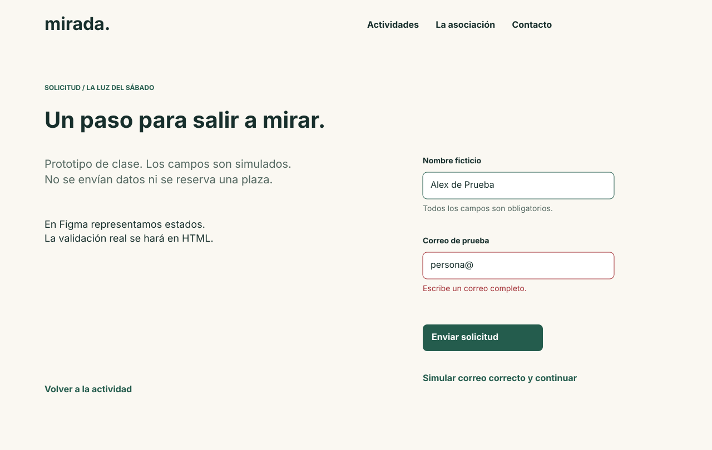](ejemplo-mirada/recursos/09-error.svg)

En esta referencia hay enlaces didácticos para **simular** datos completos o una corrección. Sirven para recorrer los estados sin fingir que Figma ejecuta validación de formularios.

### Paso 23. Diseñar la confirmación

**Referencia de UD1:** [Estructura](<Componentes de un interfaz web.md>).

Crea `Confirmación`, de 1280 × 720, con estado, explicación y botón `Volver al inicio`. El mensaje debe indicar que se trata de una solicitud simulada.

[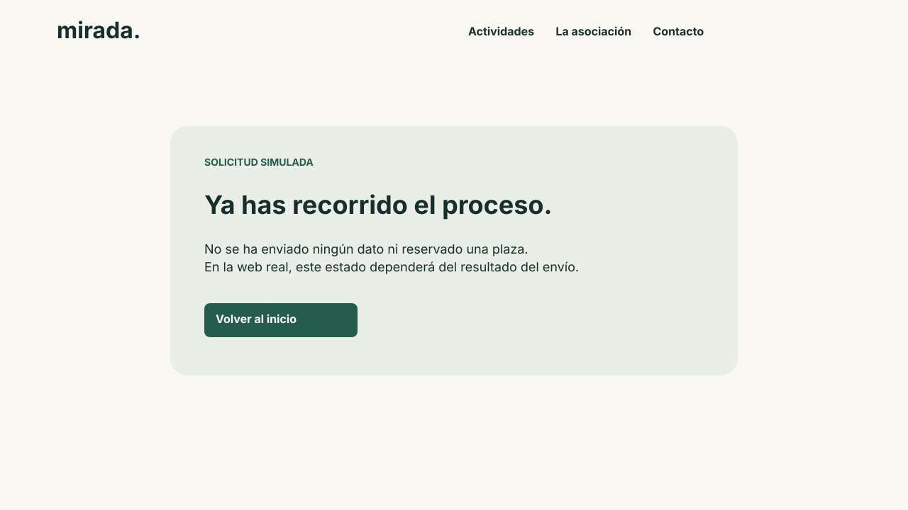](ejemplo-mirada/recursos/10-confirmacion.svg)

**Comprueba:** se distingue visualmente del error y la persona sabe qué ha ocurrido y cómo continuar.

## Bloque 5 · Trabajar imágenes y composición

### Paso 24. Importar el paisaje

**Referencia de UD1:** [Figma y composición](<EmpezarFigma.md>).

El paquete contiene `paisaje.svg` y su versión rasterizada `paisaje.png`, ambas creadas para esta práctica. Usa PNG para practicar relleno de imagen y recorte, y SVG para explorar los vectores. No son fotografías ni recursos descargados de terceros.

1. Inserta el PNG en la zona de imagen de la cabecera.
2. Crea otro rectángulo y usa la misma imagen como relleno.
3. Compara la capa independiente y el relleno de imagen.
4. Usa el cuentagotas para tomar un color de apoyo del paisaje, y comprueba después su función y contraste.

Puedes sustituirlo por una fotografía propia para practicar con otro contenido; conserva el origen y la licencia en la entrega.

### Paso 25. Recortar sin deformar

**Referencia de UD1:** [Figma y composición](<EmpezarFigma.md>).

1. Crea una caja de 488 × 318 y aplica el paisaje como relleno.
2. Compara Fit, Fill y Crop en las opciones de imagen.
3. Con Crop, cambia el encuadre conservando las proporciones del recurso.
4. Duplica la caja y compara un encuadre donde se vea la cámara y otro centrado en el paisaje.
5. Escribe cuál explica mejor la actividad y por qué.

**Comprueba:** el círculo del objetivo de la cámara no se convierte en una elipse por deformación accidental.

### Paso 26. Crear una máscara

**Referencia de UD1:** [Figma y composición](<EmpezarFigma.md>).

1. Coloca una copia de la imagen y dibuja una elipse sobre el área que quieres conservar.
2. Sitúa la forma de máscara por debajo del contenido que va a enmascarar en el orden de capas.
3. Selecciona ambos y utiliza **Use as mask**.
4. Inspecciona el grupo resultante y mueve la imagen dentro de la máscara.
5. Comprueba qué queda visible al desplazar la forma.

[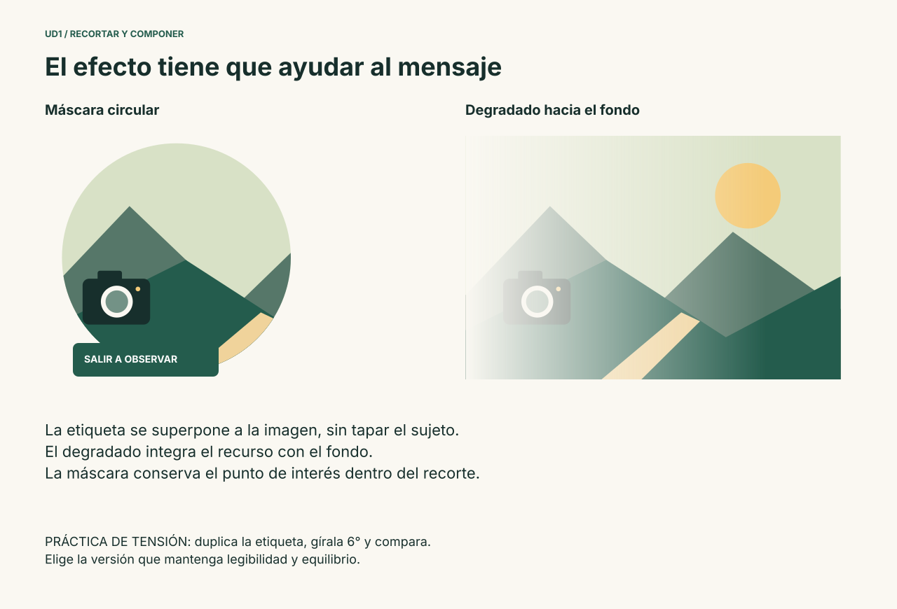](ejemplo-mirada/recursos/12-recortes.svg)

La máscara recorta la región visible; no borra el original. Si desaparece todo, revisa orden de capas, selección y tipo de máscara antes de repetir el dibujo.

### Paso 27. Añadir un velo para el texto

**Referencia de UD1:** [Figma y composición](<EmpezarFigma.md>) · [Principios visuales](<elementosDiseño.md>).

1. Duplica la imagen y añade encima un rectángulo del mismo tamaño.
2. Usa Texto `#172F2C` con opacidad inicial del **55 %**.
3. Coloca `Sal a mirar.` en blanco sobre el velo.
4. Comprueba el contraste en la zona más clara que quede detrás del texto.
5. Si no alcanza el objetivo, ajusta opacidad, encuadre o usa un fondo sólido para el texto.

[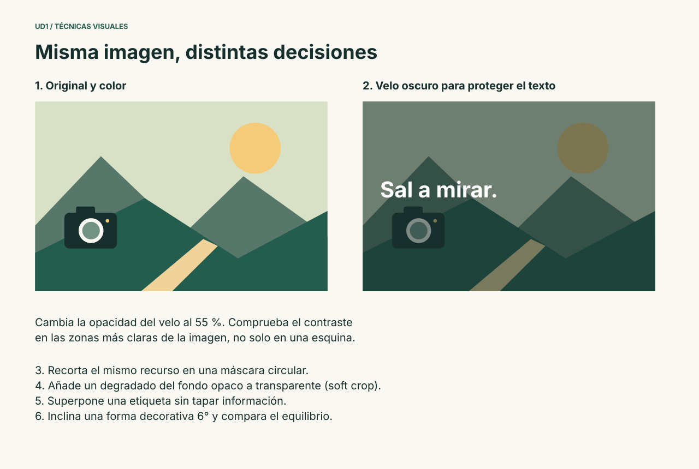](ejemplo-mirada/recursos/11-tecnicas.svg)

El 55 % es un punto de partida del ejemplo, no una garantía automática para cualquier imagen. Distingue este **velo de color** de una ventana superpuesta del prototipo.

### Paso 28. Crear soft crop con degradado

**Referencia de UD1:** [Figma y composición](<EmpezarFigma.md>) · [Principios visuales](<elementosDiseño.md>).

1. Sitúa la imagen sobre el fondo `#FAF8F2`.
2. Añade un rectángulo delante con degradado horizontal.
3. En un extremo usa ese mismo fondo con opacidad 100 %; en el otro, el mismo color con opacidad 0 %.
4. Ajusta las paradas para que el fondo se funda con la imagen.
5. Mantén el sujeto y cualquier texto esencial fuera de la zona que desaparece.

La lámina 12 muestra el resultado. No cambies a dos colores diferentes cuando quieras únicamente variar transparencia.

### Paso 29. Probar superposición

**Referencia de UD1:** [Figma y composición](<EmpezarFigma.md>) · [Principios visuales](<elementosDiseño.md>).

Coloca una etiqueta verde parcialmente encima de la imagen y fuera de su borde inferior. Usa una estructura clara de capas y comprueba que no tapa el sujeto ni información de la tarea.

La superposición puede relacionar elementos y aportar profundidad. Retira el efecto y compara: si solo añade ruido, conserva la versión simple. El espacio en blanco también organiza información.

### Paso 30. Practicar tensión, cierre y edición vectorial

**Referencia de UD1:** [Figma y composición](<EmpezarFigma.md>) · [Principios visuales](<elementosDiseño.md>).

1. Duplica la etiqueta y gírala **6°**. Compara estabilidad y tensión con la versión sin giro.
2. Duplica el icono de flecha, entra en edición vectorial y mueve un punto. Observa cuándo deja de reconocerse.
3. Dibuja una curva sencilla y modifica sus manejadores. Explora la herramienta de curvatura si está disponible.
4. Dibuja tres segmentos que sugieran una figura incompleta para observar el principio de cierre; compáralos con la figura completa.
5. Elige qué efectos aportan al diseño final. No es obligatorio incorporar todos a la misma pantalla.

Conserva estos ensayos en `06 Pruebas`, separados de las instancias de producción. La consistencia se juzga por función y reglas compartidas, no por que todos los elementos tengan forma idéntica.

## Bloque 6 · Prototipar y revisar

### Paso 31. Conectar las pantallas

**Referencia de UD1:** [Componentes](<Componentes_Figma.md>).

En Prototype, establece el inicio del recorrido en `Inicio / Amplio` y conecta:

| Origen | Control | Acción | Destino |
|---|---|---|---|
| Inicio | Ver actividad / primera tarjeta | On click → Navigate to | Detalle |
| Detalle | Solicitar plaza | On click → Navigate to | Solicitud vacía |
| Solicitud vacía | Enviar solicitud | On click → Navigate to | Error |
| Solicitud vacía | Simular datos completos | On click → Navigate to | Confirmación |
| Error | Simular correo correcto y continuar | On click → Navigate to | Confirmación |
| Detalle/Error | Enlace de regreso | On click → Navigate to | Pantalla anterior indicada |
| Confirmación | Volver al inicio | On click → Navigate to | Inicio |

Utiliza transición **Instant** para comprobar primero el recorrido. La referencia móvil conecta con las pantallas amplias para mostrar la tarea; como ampliación, duplica detalle y solicitud a 390 px y cambia sus destinos para un recorrido móvil completo.

### Paso 32. Añadir una microinteracción

**Referencia de UD1:** [Componentes](<Componentes_Figma.md>).

1. En el conjunto del botón primario, conecta Normal con Hover.
2. Usa **While hovering → Change to**, dentro del mismo conjunto.
3. Selecciona Smart Animate, unos **150 ms** y una aceleración suave.
4. Mantén los nombres de las capas correspondientes.
5. Comprueba que salir del área devuelve el estado y que el clic sigue navegando.

Change to cambia una variante; Navigate to cambia de pantalla. Representar Foco no garantiza navegación real con Tab: esa prueba corresponde a la implementación posterior. [Referencia de componentes interactivos](https://help.figma.com/hc/en-us/articles/360061175334-Create-interactive-components-with-variants).

### Paso 33. Ensayar una ventana superpuesta

**Referencia de UD1:** [Componentes](<Componentes_Figma.md>).

Construye esta práctica manualmente:

1. Crea un frame `Menú / Superpuesto` de unos 280 × 240.
2. Añade enlaces de navegación y un control `Cerrar` con texto o nombre claro.
3. Desde el control Menú de la cabecera estrecha, utiliza **Open overlay**.
4. Elige posición y fondo atenuado; conecta Cerrar mediante **Close overlay**.
5. Comprueba que al cerrar vuelves a la pantalla desde la que abriste.

Una ventana superpuesta interactiva y el velo sobre una imagen son conceptos distintos aunque ambos puedan denominarse overlay.

### Paso 34. Revisar animación y desplazamiento

**Referencia de UD1:** [Componentes](<Componentes_Figma.md>).

Prueba el prototipo con movimiento y con transiciones Instant. Comprueba que ninguna información depende de la animación. Revisa el desplazamiento vertical del inicio estrecho con un viewport menor que la altura del contenido.

No es necesario exportar un GIF para demostrar las conexiones. Puedes compartir el prototipo y conservar una grabación de su recorrido como evidencia adicional. La exportación estática no preserva interacciones.

### Paso 35. Realizar una prueba de tarea

**Referencia de UD1:** [Planificación](<planificación.md>).

Pide a una persona que averigüe qué necesita para participar el sábado. No señales dónde pulsar. Registra resultado, dudas y ayuda necesaria. Después pídele recorrer un error de solicitud, explicando que los datos están simulados.

| Observación | Decisión | Comprobación posterior |
|---|---|---|
| Escribe solo lo observado | Mantener o cambiar, con motivo | Repetir la tarea afectada |

Si no puedes realizar la prueba, indica que está pendiente. No inventes resultados ni cambies un componente solo para mostrar que has modificado algo.

### Paso 36. Comprobar el resultado

**Referencia de UD1:** [Objetivos y criterios](<objetivos.md>).

- [ ] Hay brief, tres tareas, mapa y flujo.
- [ ] Existen dos bocetos alternativos y una elección justificada.
- [ ] Los colores tienen roles y contraste registrado.
- [ ] Tipografía, espaciado e iconos siguen reglas documentadas.
- [ ] Botón, tarjeta, campo, enlace y cabecera tienen estados pertinentes.
- [ ] Los componentes se reutilizan como instancias.
- [ ] El inicio funciona visualmente en los dos anchos.
- [ ] Hay ejemplos de recorte, máscara, degradado y superposición.
- [ ] Se puede recorrer detalle, error, confirmación y regreso.
- [ ] La prueba y las limitaciones están documentadas.

### Paso 37. Compartir y exportar

**Referencia de UD1:** [Objetivos y criterios](<objetivos.md>).

1. Conserva el archivo editable en Figma con un nombre de versión.
2. Comprueba los permisos del enlace con el destinatario.
3. Exporta las pantallas como PNG o PDF para revisión visual.
4. Guarda, cuando tu entorno lo permita, una copia local `.fig` desde Figma.
5. Incluye recursos, atribuciones y registro de decisiones.

El enlace, la copia editable y las exportaciones visuales tienen funciones distintas. No entregues solo una imagen si se deben comprobar componentes y prototipado.

### Paso 38. Transferir al proyecto de la actividad 21

**Referencia de UD1:** [Actividad 21](<Actividades.md#actividad-21>).

Utiliza las mismas técnicas con tu tema. Conserva tu contenido y justifica tus decisiones; no es necesario que tu proyecto tenga el aspecto de Mirada.

| Lo que has preparado | Dónde continúa |
|---|---|
| Inventario, mapa y tareas | UD2: HTML, navegación y formularios |
| Colores, tipografía y composición | UD3: estilos y adaptación |
| Componentes y estados | UD4: organización y reutilización |
| Diseño de referencia | UD5: comparación con framework |
| Función de las imágenes y su procedencia | Bloque multimedia |
| Observaciones de la prueba | Usabilidad y accesibilidad de la web implementada |

[Volver a la actividad 21](Actividades.md#actividad-21) · [Ver el hilo del módulo](../mapaModulo.md).

## Recursos y procedencia

El paisaje, los iconos, los textos y las láminas se han creado para esta práctica. Se distribuyen con la licencia docente declarada por el curso, CC BY-NC-SA 4.0. No contienen fotografías de personas ni recursos de terceros incrustados. La fuente Inter se solicita al editor; no se distribuye su archivo.

Referencias técnicas: [Auto Layout](https://help.figma.com/hc/en-us/articles/360040451373-Guide-to-auto-layout), [componentes interactivos](https://help.figma.com/hc/en-us/articles/360061175334-Create-interactive-components-with-variants), [WCAG](https://www.w3.org/WAI/WCAG22/quickref/) y [API de plugins](https://developers.figma.com/docs/plugins/). El ejemplo aplica estas técnicas; las posiciones y colores son decisiones propias de esta práctica.
