# Figma

En este curso vamos a utilizar Figma como herramienta de diseño de interfaz colaborativa. Con ella los podemos crear, probar y compartir los diseños.

Trabajaremos con **Figma Design desde el navegador**, en https://www.figma.com. Inicia sesión con tu cuenta y crea un archivo de diseño. No necesitas instalar la aplicación de escritorio para las actividades del curso.

Con respecto a las cuentas empezaremos con la gratuita que tiene algunas limitaciones. Las condiciones del acceso educativo y los permisos deben comprobarse con las cuentas del aula antes de comenzar.

Utiliza la cuenta y el espacio de trabajo indicados en clase. La construcción manual se puede organizar en una sola página; confirma que puedes editar y compartir tu archivo.

Aquí tenemos tutoriales que podemos visitar para tomar un primera contacto con la aplicación. .

https://www.figma.com/community/file/923140611594993345

https://www.juanpol.com/herramientas-figma/

Una vez que investigues en los tutoriales y tengas las cuenta creada. Deberás hacer la **Actividad 9**.

La siguiente actividades que vas ha realizar son sobre tipografía y de color. En estas actividades ya se considera que tenemos una pequeña soltura con Figma.

## Tipografías en Figma

Con respecto al conjunto de fuentes que tiene la aplicación Figma. Usa una familia disponible para todos los participantes. Para trabajar solo desde la web, utiliza fuentes disponibles en el editor, como Inter; evita depender de fuentes instaladas en tu ordenador.

Antes de compartir, revisa si el editor indica fuentes ausentes.

### Parámetros del texto

Si seleccionamos un elemento texto podemos ver en la parte derecha inferior lo que podemos configurar. Además, como podemos ver en la imagen, si apretamos sobre los tres puntos, podemos encontrar más parámetros que configurar como Mayúsculas y decoración del texto.

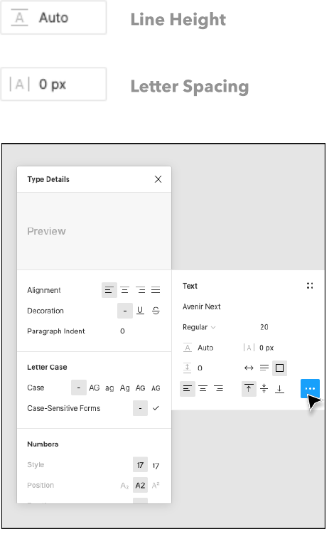

## Colores

### Color picker

El color de un objeto se maneja através de la propiedad de relleno (fill),algunas veces stroke si es una línea.

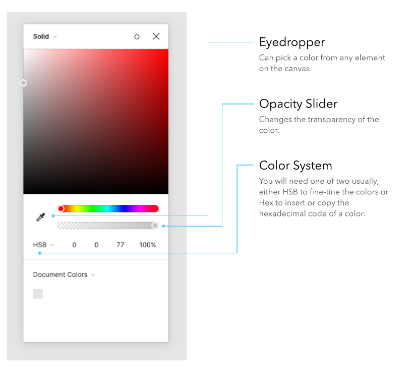

Desde el color picker podemos editar el color, para ajustar los colores podemos cambiar de HEX a HSB valores.

## Alineamiento y Grid

### Alineamiento

Agrupa los elementos relacionados con una alineación consistente. Puedes combinar bloques centrados y alineados a la izquierda si su función y relación son claras. Compara dos alternativas y comprueba el orden de lectura; no existe una prohibición universal de mezclar alineaciones.

### El Grid

Si disponemos de una página y la dividimos en columnas de igual tamaño, tendremos un grid. Este nos puede ayudar a alinear los elementos y determinar el tamaño en columnas que ocupan. Esta técnica ya se utilizaba cuando se enmaquetaban los periódicos de forma manual.

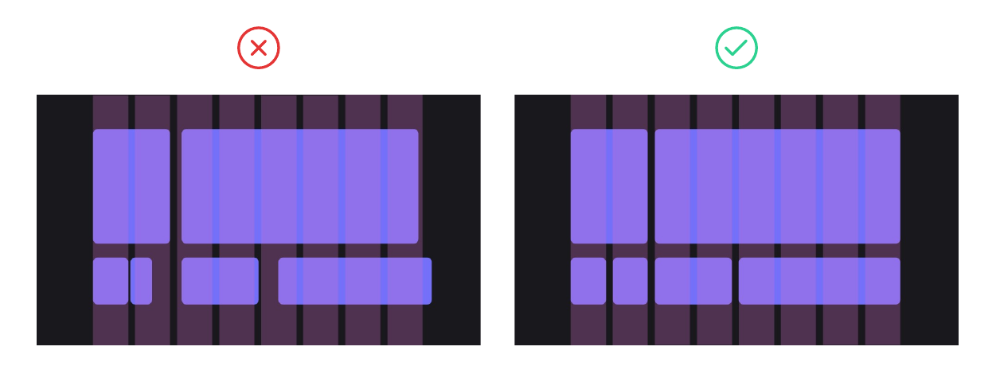
Figma dispone la posibilidad de crear nuestro grid desde Layout Grid, seleccionando columnas opciones. El grid más común es de doce columnas con un espaciado (gutter) de 20-40px.

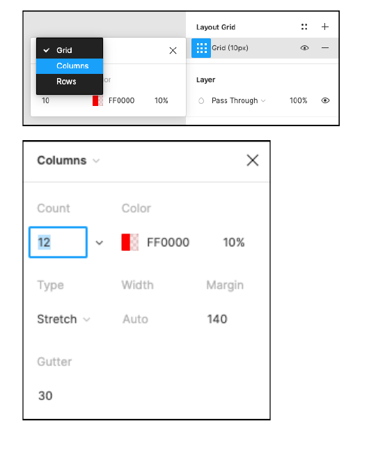

## Jerarquía visual

La jerarquía visual es el principio de diseño que consiste en dotar de un orden a los elementos de una interfaz según su importancia, para facilitar la interacción a la persona usuaria.

Una jerarquía visual correcta permite facilitar la comprensión de la información y guiar la interacción hacia las acciones que se buscan incentivar.

A menudo trabajamos con interfaces saturadas de elementos e información. No aplicar una jerarquía visual que ordene y priorice los componentes de la interfaz creará confusión y frustración e incrementará la carga cognitiva de la persona usuaria.

Observa esta [página](https://www.lingscars.com/). Tiene un montón de fallos pero uno de ellos es que al usuario no lo dirige y no sabe que ver. Es decir, que no ve nada.

Hay una serie de características y elementos con los que podemos jugar para construir jerarquía visual y ordenar la importancia del contenido. Como el tamaño, color, proximidad, alineamiento, repetición, espacios vacíos, etc todo lo hemos visto en la teoría.

## Overlay

Si nos fijamos en imagen de abajo. Nos muestra una web con una foto fantástica y un diseño típico. Pero tiene un gran error. NO se puede leer el texto, ya que no hay suficiente contraste entre el background y cada uno de los objetos.

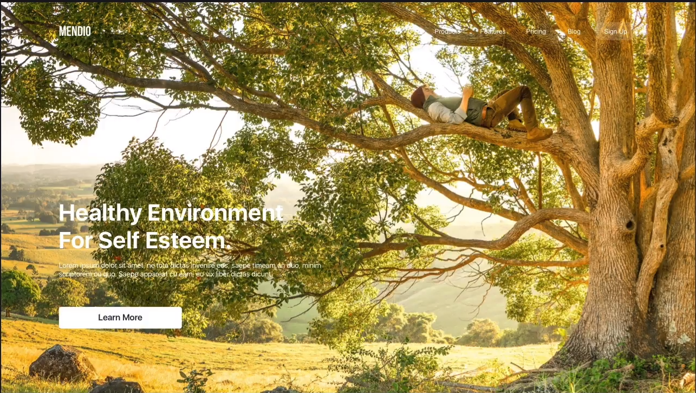

Hay varias soluciones, una de ella es desturar la imagen, hacerla en blanco y negro y después rellanarla con otro color que haga más constraste como podemos ver en la siguiente imagen.

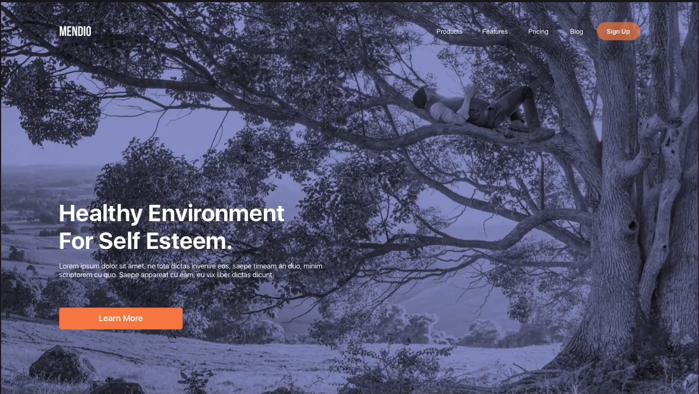

Otras solución es poner cajas transparentes detrás del contenido y añadir negro.

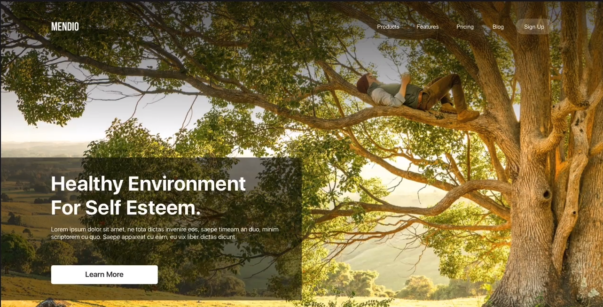

## Recortes

En la actividad 12 hemos visto como podemos seleccionar elementos de una foto realizando recortes mediante máscaras. Ahora vamos a analizar unos cuantos ejemplos para saber cuál es la finalidad.

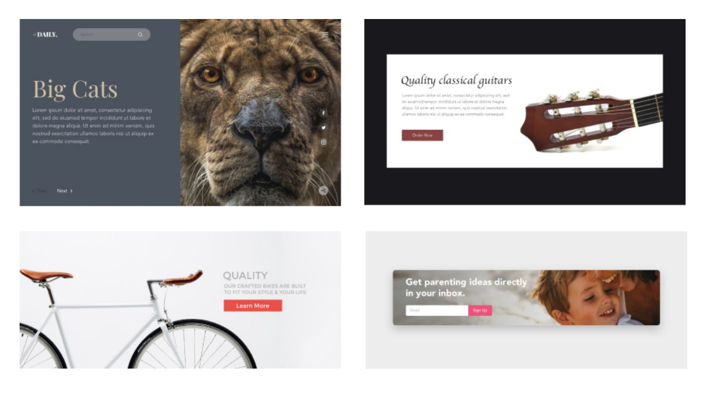

Como podemos ver en la imagen de arriba. El león no tiene el mismo efecto si fuera de cuerpo entero. Si se pone la cara muestra más fiereza y personalidad que es lo que estamos buscando. En el caso de la guitarra y la bicicleta solo hace falta poner un elemento del objeto para dar toda la información al usuario que completará la imagen. Y en el caso del banner nos hemos centrado en la emoción de la madre con la hija.

Otra forma de hacer recortes o más bien complementar una imagen que vamos a poner en la web. Esto se conoce como **Soft crop**.

En esta técnica el contenido se dispone en un lado cuyo fondo se mezcla con el fondo de la imagen. Como vemos en la imagen.

Para crear este efecto en Figma, necesitas añadir un rectángulo con un gradiente lineal de relleno. El color debe ser **el mismo pero cambia desde un 100% de transparencia a un 0%**. El color tiene que ser uno que sea adecuado dependiendo de la foto. En este caso el blanco es adecuado, pero también podemos utilizar el color picker para ir cogiendo colores.

Para realizar un gradiente se utiliza el relleno en una capa. Como indica la siguiente imagen.

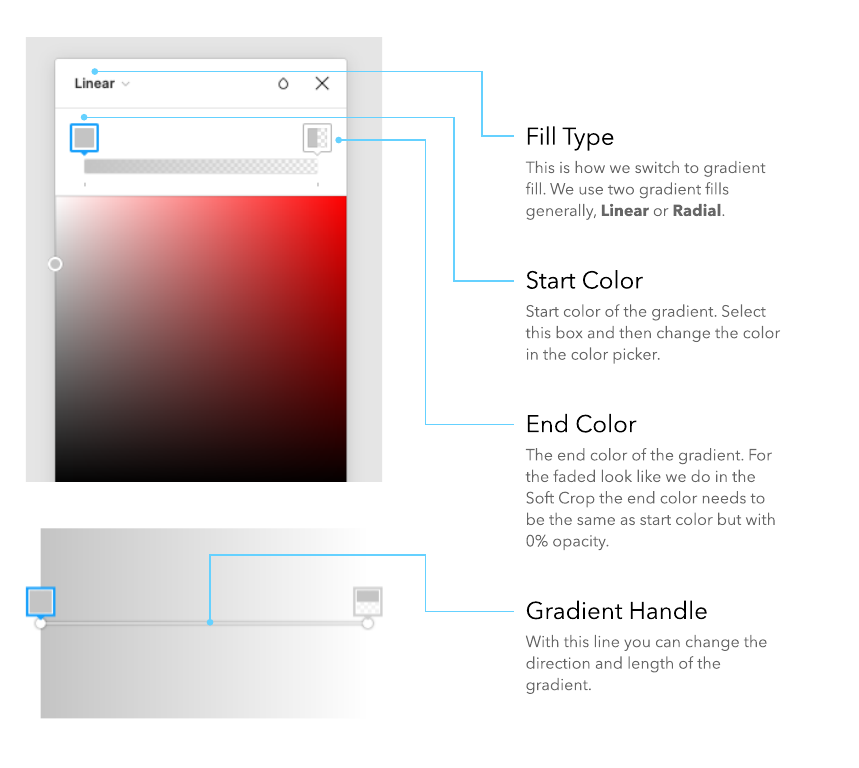

## Repaso de conceptos básicos

### Contraste

El contraste puede ser expresado principalmente de tres maneras:

1. Contraste por peso. Es decir por grueso.
2. Contraste por tamaño. Si ponemos dos elementos uno más grande que el otro.
3. Contraste por Color. Por ejemplo, negro y blanco contrastan por luminosidad; no son una pareja de colores complementarios. El contraste cromático depende de los colores y del modelo utilizado.

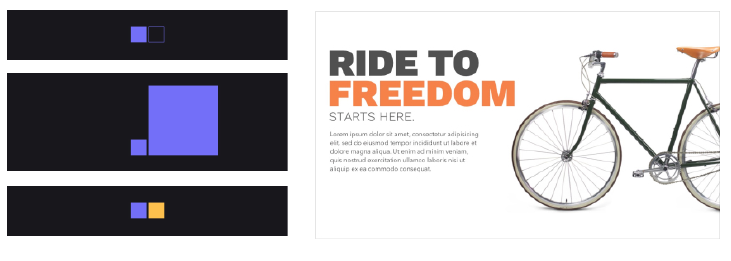

### Espacios en blanco

El espacio en blanco llama la atención sobre el proyecto. No solo es más fácil ver el objeto, sino que lo vuelve mucho más interesante e importante.

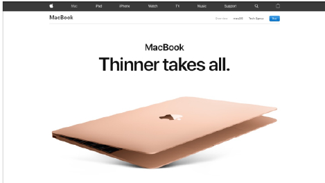

### Repetición

La repetición de elementos idénticos o similares comunica relación y consistencia. Reserva las diferencias para señalar una función o estado distinto.

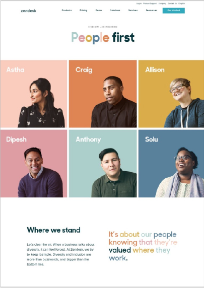

### Superposición

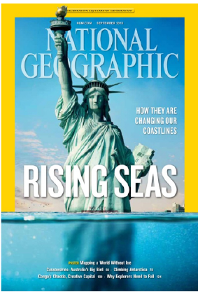

Como podemos ver en la imagen superior, la mano de la estatua de la libertad se superpone sobre el título y el cuadro amarillo. Esto hace el diseño más interesante.

¿Qué es lo que conseguimos con esto?. Pues, **agrupar elementos deconectados y dramatización en el diseño**. Ahora para el usuario es algo interesante e intenta resolver el puzzle.

Vamos a poner algunos ejemplos de como lo podemos hacer.

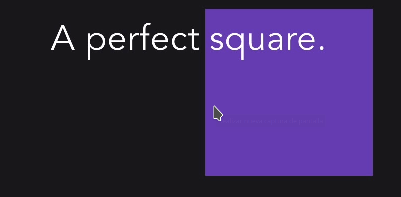

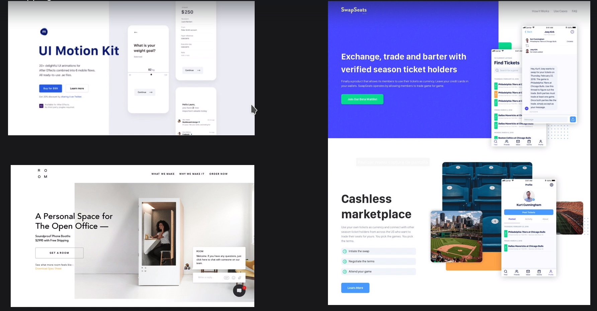

### Tensión

Podemos dar más interés a nuestros diseños utilizando la tensión visual. La tensión visual puede ser creada por :

- Inclinando elementos y usando ángulos, para crear una sensación de movimiento.
- Colocación de elementos en el borde.
- Elementos en movimiento fuera de equilibrio.
- Ocultando partes de los objetos.

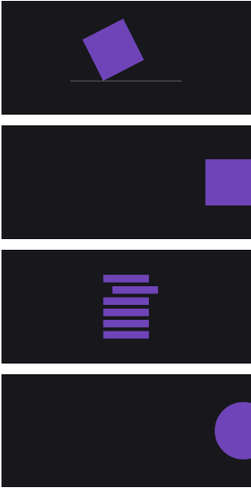

Cuando hacemos doble click sobre un objeto entramos en modo edición. Podemos crear nuevas formas arrastrando los puntos de los vectores.
Además podemos crear formas suaves usando **bend tool**.

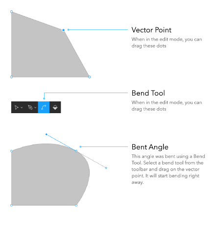

### Consistencia\.

Esto no es un concepto en si, es un principio básico. Deberemos mantener consistencia sobre:

- **Layout (estructura).**
  No puedes mezclar alianeamientos. Y debes mantener la misma estructura sobre todas las página.
- **Tipografía.**
  Hay que seleccionar tipo y forma de letra para cada elemento de nuestra web.
- **color**.
  Establecer un conjunto de colores y utilizarlos siempre en el momento definido en toda la web.
- **Forma**
  No podemos tener un botón primario rectangular y el secundario con bordes redondeados. Por ejemplo, podemos tenerlo de distinto color.
- **Photos**
  - No utilizar fotos en cajas.
  - Utilizar fotos con niveles de zoom una al lado de otra.
  - Utilizar fotos con modelos que den a entender muy diferentes emociones.
  - Utilizar fotos con muy diferentes filtros.

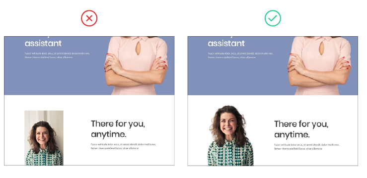

- **Iconos.**
  Utilizando iconos con diferentes estilos podemos crear incosistencia. Como se muestra en la siguiente imagen.

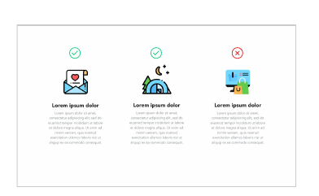
