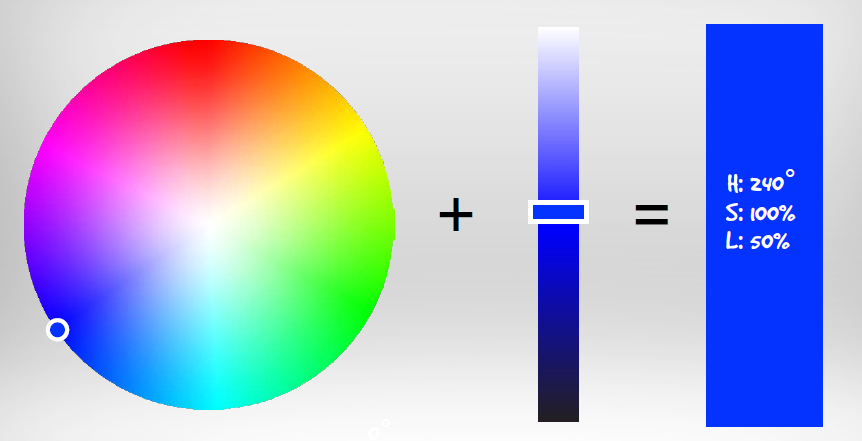
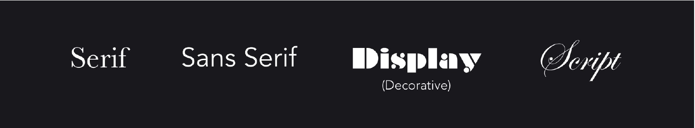
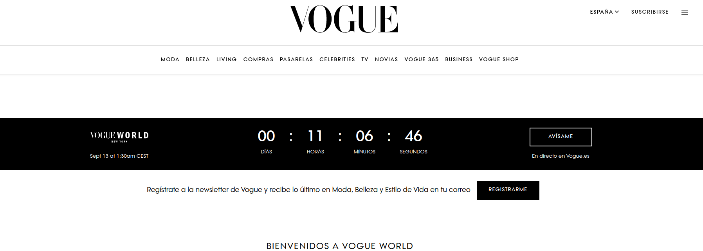
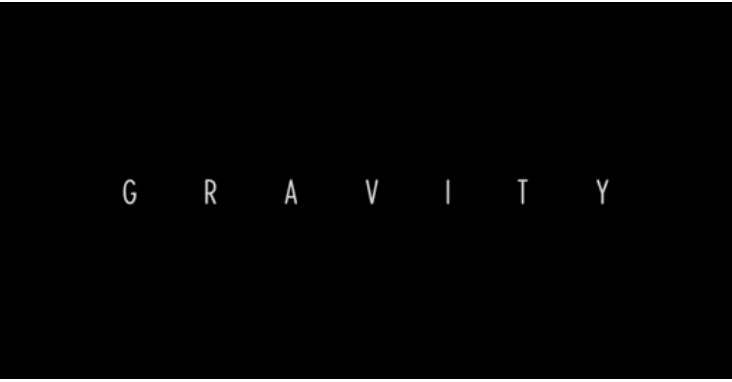
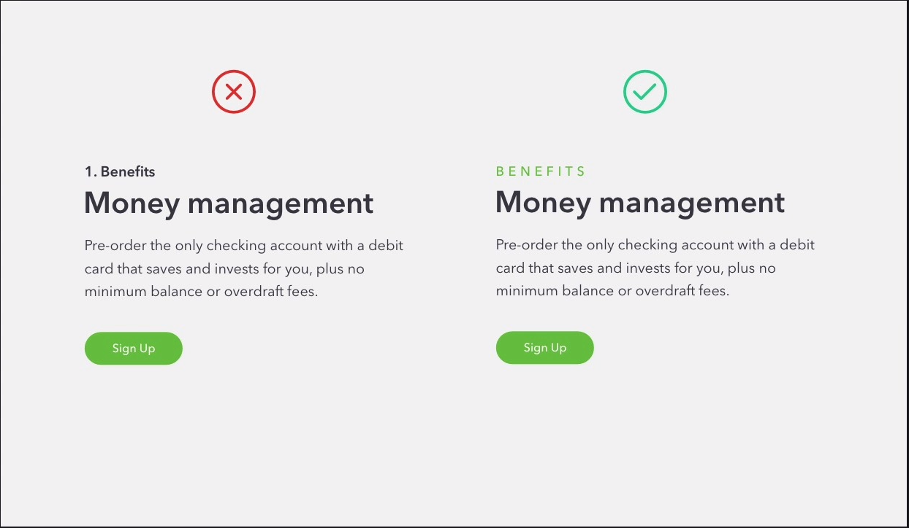
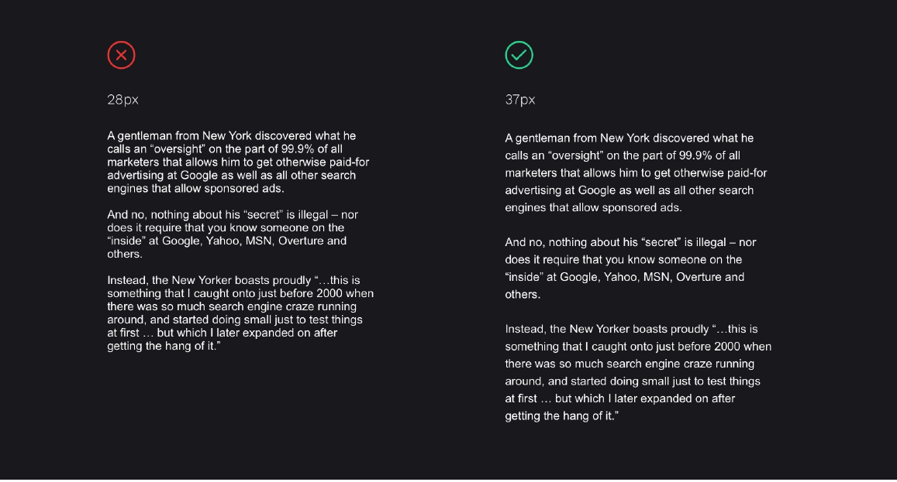
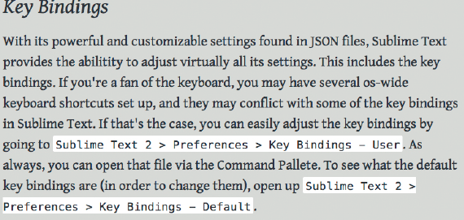
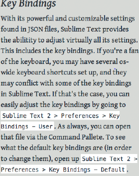

# Color, tipografía e iconos

## Color

Ten en cuenta que una misma página se puede ver de distinta forma según la plataforma, sistema operativo, navegador y monitor empleados.
La rueda tradicional de pigmentos que aparece a continuación usa rojo, amarillo y azul (RYB) como primarios. Es una herramienta de composición; no debe confundirse con RGB, que representa mezclas de luz, ni con CMY, usado en reproducción sustractiva. Permite explorar estas relaciones:

- **Colores primarios, secundarios y terciarios.**
  - Hay tres **colores primarios**:  rojo , \* amarillo  y  azul , que están dispuestos en la rueda formando un triángulo equilátero.
  - En el lado de la rueda opuesto a cada uno de los colores primarios se sitúan los tres **colores secundarios**:  verde,  púrpura  y naranja . Cada uno de los colores secundarios se consigue con la mezcla de sus dos colores primarios adyacentes. El verde viene de la mezcla del amarillo y el azul, el púrpura viene de la mezcla del azul y el rojo y, el naranja viene de la mezcla del rojo y el amarillo. Los tres colores secundarios forman también un triángulo equilátero.
  - Por último, están los **seis colores terciarios** que son los que se consiguen con la mezcla delcolor primario y del color secundario adyacente al mismo. Así, tenemos el azul-verdoso, el amarillo-verdoso, el amarillo-anaranjado, el rojo-anaranjado, el rojo-púrpura y el azul-púrpura.
- **Colores fríos y colores cálidos.**
  - **Son colores fríos** todos los colores situados en la rueda de color entre el amarillo-verdoso y el púrpura.
  - **Son colores cálidos**, todos los colores situados en la rueda de color entre el rojo-púrpura y el amarillo.
- **Colores complementarios, análogos y monocromáticos.**

  - **Los colores complementarios** son los colores que están en lados opuestos de la rueda de color. Se utilizan para crear contraste.
  - **Los colores análogos** son los colores que se encuentran juntos en la rueda de color. Se suelen usar para crear la armonía del color.
  - **Los colores monocrómáticos** son todos los tonos y matices de un mismo color.

  En los siguientes enlaces puedes ver una página Web donde podrás ir comprobando la información que te daremos sobre los colores. Además te serán de gran ayuda cuando diseñes los colores de tu sitio Web.
  http://colorschemedesigner.com/ inglés

### Sistema RGB

RGB representa colores combinando luz roja, verde y azul. En este modelo aditivo, el negro corresponde a la ausencia de luz y la combinación de los tres canales al máximo produce blanco. No describe toda la percepción humana ni permite reproducir todos los colores visibles.

En una representación de 8 bits por canal, cada canal tiene 256 valores. Sus combinaciones son 256 × 256 × 256 = 16.777.216. Es una representación habitual, no la única profundidad de color posible.

A la hora de representar cada color utilizamos este modelo RGB y lo podemos hacer empleando tanto el sistema de numeración decimal como el sistema de numeración hexadecimal.
En la imagen puedes ver las diferentes informaciones suministradas por la página web sobre esquemas de colores de diseño cuyo enlace tienes disponible en la página anterior de este mismo apartado. Se ha elegido en el sistema RGB una tríada compuesta por un color primario: el azul y los equidistantes a su color complementario. En la parte inferior de la imagen puedes ver los códigos hexadecimales correspondientes a cada combinación de color y, en la parte de la derecha de la imagen, sobre un fondo blanco, puedes ver la equivalencia en decimal de estos códigos hexadecimales.

### Sistema CMY (subtractivo)

Trabaja mediante la absorción de la luz (colores secundarios). Los colores que se ven son la parte de luz que no es absorbida. En CMY, magenta más amarillo producen rojo, magenta más cian producen azul, cian más amarillo generan verde y la combinación de cian, magenta y amarillo forman negro.

### Modelo HSL

HSL expresa un color mediante **matiz, saturación y luminosidad**:

- **Matiz (Hue):** posición angular en la rueda, expresada habitualmente entre 0 y 360 grados.
- **Saturación (Saturation):** 0 % produce un gris y 100 % la máxima saturación del modelo para ese matiz y luminosidad.
- **Luminosidad (Lightness):** 0 % produce negro, 100 % blanco y los valores intermedios permiten explorar tonos claros y oscuros.

No confundas luminosidad con frecuencia de onda ni con la luminancia utilizada al calcular contraste. Dos colores con la misma L pueden percibirse con distinta claridad. [Referencia HSL de MDN](https://developer.mozilla.org/en-US/docs/Web/CSS/Reference/Values/color_value/hsl).

### Colores seguros: contexto histórico

La paleta de 216 colores combinaba los valores hexadecimales 00, 33, 66, 99, CC y FF en los tres canales. Se utilizaba para reducir problemas con paletas limitadas. No es una restricción para diseñar la web del proyecto ni garantiza una apariencia idéntica en todos los dispositivos.

### Elegir por función y comprobar contraste

Asigna funciones a los colores: texto, fondo, acción principal, borde y error. Una paleta extraída de una fotografía es una referencia visual; después hay que comprobar las combinaciones que se usarán realmente.

Para texto normal, toma como referencia un contraste mínimo de 4,5:1; para texto grande, 3:1 según la definición de WCAG. Comprueba texto y fondo también en estados interactivos. Añade mensajes o formas cuando el color transmite información. [Referencia WCAG](https://www.w3.org/WAI/WCAG22/quickref/).

**Práctica:** registra tres pares texto/fondo, su contraste y el uso previsto. Si no cumplen el objetivo, ajusta el color y repite la comprobación. Las asociaciones emocionales de un color dependen del contexto; justifica la elección con el propósito de la interfaz.

El uso de una fuente familiar al usuario aumenta la facilidad de lectura. A la hora de elegir la tipografía más adecuada hay que tener en cuenta varios aspectos.

### La fuente

La legibilidad depende de la fuente, tamaño, peso, contraste y espaciado. Prueba texto real en distintos tamaños: ninguna familia garantiza por sí sola la lectura en todos los contextos. Revisa también la licencia y los caracteres que necesitas, como tildes y eñes.

Páginas para descargar fuentes:

- [FreeFonts](https://www.1001freefonts.com/es/)
- [DaFont](https://www.dafont.com/es/)
- [GoogleFont](https://google.com/fonts)

#### Personalidad

Cada estilo tiene una personalidad, Algunas son divertidas, otras son estrictas y contundentes, y algunas otras más academicas y elegantes.Es muy importante la elección de su estilo. La elección debe responder al contenido y al contexto, sin asignarle un porcentaje fijo del diseño.

Hay diferentes categorias. Podemos agruparlas en cuatro grandes categorias que son:

En primer lugar, la mayoría de los tipos de letra se incluyen en estos dos grupos. Serif o Sans Serif.
La diferencia esta en las colas en la letra se llaman serifas. En francés "sans" significa "sin". Entonces, "Sans Serif" significa "Sin serif".

- **Serif**: Hay tres estilos importantes dentro de esta:

  - **Old Style**: Este es el estilo más utilizado en la impresión y la mayoría de los libros se configurarán en este tipo de letra.También pueden utilizarse en interfaces web.

    Comprueba el dibujo de la fuente al tamaño de lectura: no descartes una familia solo por tener serifas.

    Estas pueden ser utilizadas para webs que quieren mostrar refinamiento o una apariencia clásica. Por ejemplo, restaurantes exclusivos, instrumentos musicales, bufetes de abogados, etc.

    **Ejemplo de fuentes:** **Baskerville,Garamond,Palantino**

  - **Modern**: La mejor manera de saber si la fuente es moderna es mediante la serifa plana. Otra característica muy distintiva es el contraste entre gruesos y delgados.
    Los tipos modernos se utilizan con frecuencia para la moda y todas las cosas de lujo. Aunque no están limitados a esto. Se puede utilizar para retratar una personalidad **seria, moderna y refinada**.

    **Ejemplo de fuentes:** **Onyx,Bodoni,Didot**.

    **Consejo**: el estilo moderno lo utilizaría para títulos grandes.

  

  - **slab**: Este es un estilo, que como el anterior, es utilizado para títulos. Es adecuado para sea **mecánica o fuerte.**
    **Ejemplo de fuentes:** **Rockwell,Josefin slab, Roboto Slab**.

- **San Serif**: Será el tipo principal que usarás en la mayoría de los proyectos.Es el más versátil, puede encajar en un diseño con mucha personalidad.
  Es la apuesta más segura de todos los estilos. Puede funcionar perfectamente tanto para texto de párrafo como para títulos.
  La personalidad de las fuentes, en general, Sans Serif podemos catagorizar en **moderna, seria y neutral.**
  **Ejemplo de fuentes:** **Helvetica,Arial, Open Sans**.

- **Display**: De personalida muy marcada. Por lo que si elegimos mal , podemos encontrar una web muy tonta. Su personalidad puede variar desde el tipo que se escribe en una pizarra, hasta algo que puede ser muy elegante. Con todo esto, este tipo de estilo debermos utilizarlo solo para títulos.

  **Ejemplo de fuentes:** **Chalkduster,Braqqadocio,Metropolis**.

- **Script**: Se basan en la escritura a mano. Al igual que Display, hay que estar seguros cuando la utilicemos. Por ejemplo, sería muy util. Si tuvieramos que diseña un sitio web para una guardería. Pero solo para el título.

Consulta la documentación de la fuente, cuando esté disponible, para conocer sus usos, variantes y licencia.

**Para este proyecto, empieza con una o dos familias tipográficas.** Es una restricción del ejercicio para practicar coherencia, no una regla universal.

#### Espaciado entre las letras

El espaciado entre letras modifica la textura del texto. Puede ajustarse en títulos y otros elementos, pero debe comprobarse su legibilidad. No exige utilizar siempre mayúsculas.

Como vemos solo con la separación de las letra hemos conseguido dar importancia al titular.

Por ejemplo, podemos utilizar esta técnica cuando necesitemos un título además del que tenemos en el parrafo. Observemos, la siguiente imagen.

Prueba cambios pequeños con el tamaño y peso definitivos. No apliques una cantidad de espaciado fija a todos los textos: compara el resultado y conserva la opción más legible.

#### Espaciado entre líneas

El interlineado regula la separación vertical entre líneas. Como punto de partida del ejercicio, prueba entre 1,4 y 1,6 veces el tamaño del texto y ajusta según la fuente y la longitud de línea. No es una medida obligatoria para todos los componentes.

En esta imagen podemos ver la diferencia entre los dos párrafos con el mismo tipo de fuente.

#### Grosor de la fuentes. Font Weight.

Light, regular, semibold y bold son ejemplos de pesos. Escoge los que necesitas para distinguir funciones; no es obligatorio incluir cuatro. Más adelante comprobaremos el coste de cargar archivos tipográficos innecesarios.

#### Número de caracteres por línea.

Como orientación para párrafos de lectura, prueba unas 50–70 **letras, signos y espacios por línea**, es decir, caracteres, no palabras. Ajusta al contexto y comprueba el resultado real. En CSS podrás limitar el ancho mediante `max-width`; lo trabajaremos en las siguientes unidades.

La abreviatura CPL significa caracteres por línea. Las capturas siguientes ilustran casos concretos: el resultado depende de la fuente, el tamaño y el contenido; un ancho en píxeles no garantiza un CPL determinado.

En pantallas estrechas caben menos caracteres. Prioriza un tamaño legible y evita forzar el mismo CPL que en escritorio.

## Iconos

Los iconos pueden representar acciones o apoyar la identificación de contenido. Acompaña los que sean ambiguos con texto visible. En el prototipo documenta su función y etiqueta; en HTML se implementará el nombre accesible del control. Un icono decorativo necesita un tratamiento diferente de uno que ejecuta una acción.

Es importante respetar una apariencia similar entre todos los iconos para disponer de una buena armonía y navegabilidad.
Los iconos se pueden encontrar en formatos diferentes:

- **Mapa de bits**:PNG, GIF y JPG.
- **Imagen vectorizada**: SVG.
- **Fuentes tipográficas**: las fuentes de texto pueden ofrecer iconos sencillos para la representación de elementos de la interfaz.

Páginas para descargar iconos:

- <a class="mfn-link mfn-link-7 " href="https://www.flaticon.es/" style="" data-hover="Flaticon" ontouchstart="this.classList.toggle('hover');">Flaticon</a>
- <a class="mfn-link mfn-link-7 " href="https://www.iconfinder.com/free_icons" style="" data-hover="IconFinder" ontouchstart="this.classList.toggle('hover');">IconFinder</a>
- <a class="mfn-link mfn-link-7 " href="https://www.freepik.es/iconos-populares" style="" data-hover="Freepik" ontouchstart="this.classList.toggle('hover');">Freepik</a>
- <a class="mfn-link mfn-link-7 " href="https://fontawesome.com/" style="" data-hover="FontAwesome" ontouchstart="this.classList.toggle('hover');">FontAwesome</a>

## Guía de estilo: color, tipografía e iconos

Para asegurar la consistencia de las interfaces gráficas de una web es fundamental plasmar las pautas de estilo en una guía que pueda seguir el equipo de desarrollo (programadores, analistas, diseñadores gráficos, etc.) durante el proceso de desarrollo del sitio. Estas guías se llaman guías de estilo o “look and feel”.

Las guías de estilo recogen los criterios y normas que deben seguir los desarrolladores de un sitio web para que tenga una apariencia uniforme y atractiva para el usuario.

Desde el punto de vista de los programadores y los diseñadores, estas guías de estilo son esenciales para favorecer el desarrollo de una página web, tanto en el diseño como en su posterior mantenimiento. Este aspecto es muy importante ya que el mantenimiento puede ser llevado cada vez por una persona.

En las guías de estilo se recogen datos como la gama de colores utilizada, los iconos, la tipografía, el tamaño de las letras, etc. A continuación se muestra un ejemplo de guía de estilo en la que se detallan los colores, las tipografías, los botones y los iconos de referencia.

### Ejemplos guías de estilo

Veamos ahora el siguiente tablero de Pinterest en el que se han recogido diferentes guías de estilo.

- <a class="mfn-link mfn-link-7 " href="https://material.io/design/" style="" data-hover="Material Design" ontouchstart="this.classList.toggle('hover');">Material Design</a>
- <a class="mfn-link mfn-link-7 " href="https://www.youtube.com/intl/es/yt/about/brand-resources/#logos-icons-colors" style="" data-hover="Youtube" ontouchstart="this.classList.toggle('hover');">Youtube</a>
- <a class="mfn-link mfn-link-7 " href="https://developer.apple.com/design/human-interface-guidelines/" style="" data-hover="Apple" ontouchstart="this.classList.toggle('hover');">Apple</a>

## Llevar la guía visual al proyecto

Registra función, valor y ejemplo de cada decisión: color de texto, fondo y acción; familia, tamaño y peso; espaciado; iconos y estados. Incluye el resultado de las comprobaciones de contraste y la procedencia de fuentes e imágenes.

[Aplicar en la actividad 21](Actividades.md#actividad-21). En UD2 se conserva la estructura del contenido y en UD3 se trasladan estas decisiones a CSS.
