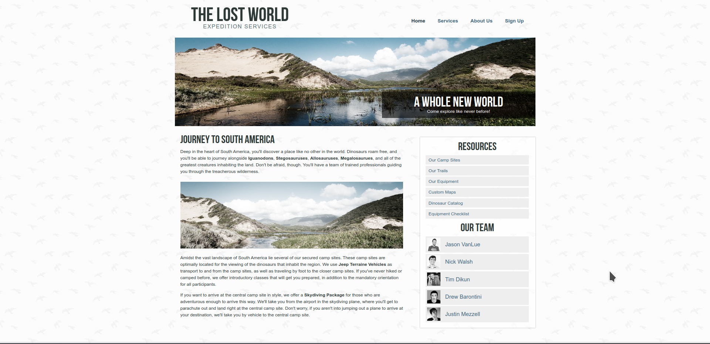

# Actividad Flex

## Objetivo

Crea la siguiente página web mediante flex.No obstante, puedes utilizar todo lo que has aprendido sobre el posicionamiento y las estructuras.

## Screenshot de la web

## Mi proceso

### Construido con

- Semantic HTML5
- CSS custom properties
- Flexbox

### ¿Qué he aprendido?

Recopila los aspectos más importantes y aquello que te haya costado más en el momento de construcción de la web. Además de herramientas que te hayan servido de apoyo. En un fichero README.md (fichero markdown)

Si quieres obtener más ayuda para escribir Markdown,consulta la [Guía de Markdown](https://www.markdownguide.org/) para obtener más información. De todas maneras, en VSCODE tenemos extensiones que te pueden ayudar.
